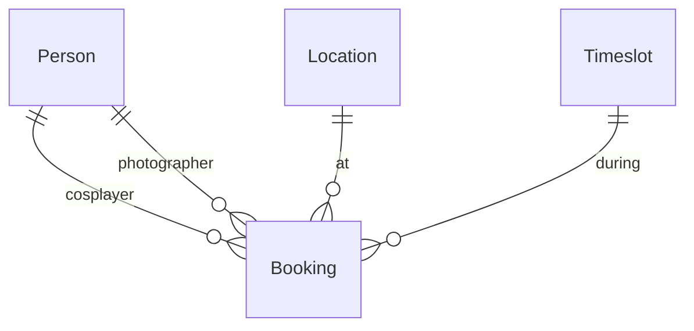
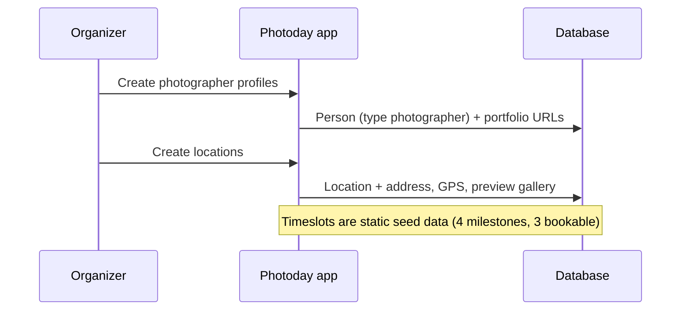
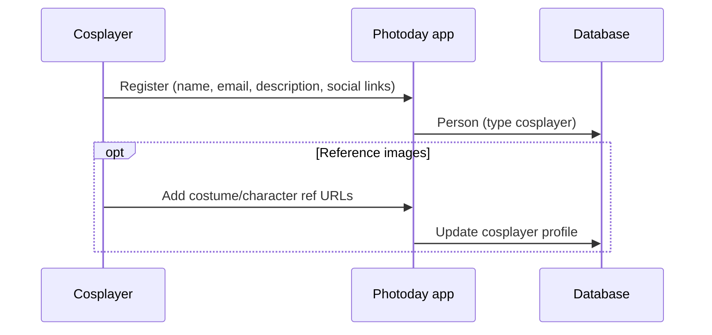
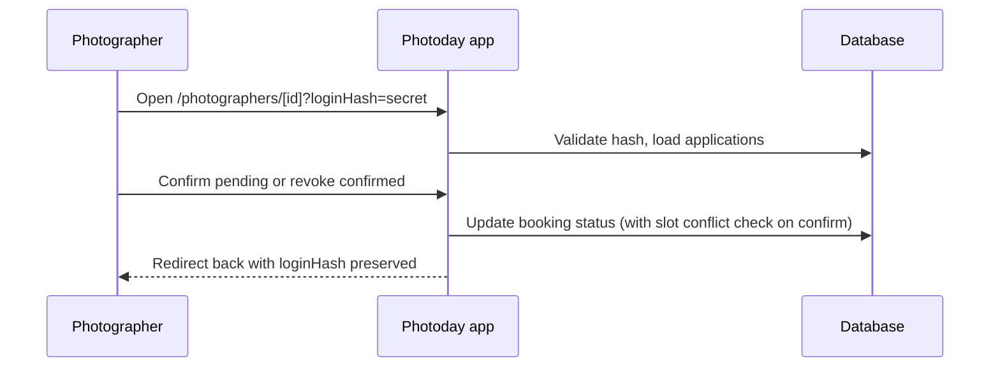

# App Workflow

How MMC Photoday coordinates photographers, cosplayers, locations, and timeslots for Mini Movie Con photoday at `photoday.minimoviecon.sk`.

**Status:** Domain tables and core flows are implemented. Cosplayers submit pending applications at `/bookings`; photographers confirm or revoke on `/photographers/[id]?loginHash=…`. Organizer admin UI and full session auth remain deferred.

**Photographer review (loginHash):** [photographer-application-review.md](./photographer-application-review.md)

**Source of truth for entity fields:** [domain-models requirements](../brainstorms/2026-07-06-domain-models-requirements.md)

---

## Product goal

Cosplayers self-book a photo session by choosing:

1. **Location** — where the shoot happens
2. **Timeslot** — when (one of three fixed shoot windows)
3. **Photographer** — who shoots

**Core rule:** at most **one booking per location per shoot timeslot**. A location cannot host two sessions in the same window.

Organizers prepare the catalog (photographers and locations) before booking opens. Cosplayers register themselves and then book.

---

## Actors

| Actor | Role | Profile ownership |
|-------|------|-------------------|
| **Organizer** | Creates photographer profiles and locations; admin access (auth deferred) | Organizer-maintained |
| **Photographer** | Appears as a bookable option; sees their session queue (future) | Organizer creates profile |
| **Cosplayer** | Self-registers, then books sessions | Self-registration |
| **Visitor** | Reads public homepage; no scheduling actions in v1 | — |

---

## Domain model

Four entities power the scheduling flows.

### Person (unified profile)

One table with a `type` discriminator: `photographer`, `cosplayer`, or `organizer`.

| Field | All types | Photographer | Cosplayer | Organizer |
|-------|-----------|--------------|-----------|-----------|
| name, email | required | | | |
| description | optional | | | |
| social links (Instagram, Facebook, Twitter/X, website) | optional | | | |
| portfolio gallery (image URLs) | | optional | — | — |
| reference images (image URLs) | | — | optional | — |
| `login_hash` | | optional, unique | — | — |

- `email` is unique across all Person records.
- `login_hash` is used only for photographer application review (see [photographer-application-review.md](./photographer-application-review.md)); not shown on public pages. Set automatically on catalog import.
- Galleries are ordered URL lists; file upload is deferred.

### Location (bookable spot)

Replaces the earlier "site" terminology.

| Field | Required |
|-------|----------|
| name | yes |
| description, address, GPS (lat/lng) | optional |
| preview gallery (image URLs) | optional |

Organizer creates and edits locations before cosplayers can book.

### Timeslot (static day schedule)

Fixed for the event day — not organizer-configurable.

| Label | Time | Bookable |
|-------|------|----------|
| Gatherup | 9:00 | no — shown on day schedule only |
| First shoot | 9:30 | yes |
| Second shoot | 11:00 | yes |
| Third shoot | 12:30 | yes |

### Booking (session / application)

Links exactly one of each:

- cosplayer (Person, type cosplayer)
- photographer (Person, type photographer)
- location
- bookable shoot timeslot (9:30, 11:00, or 12:30)

**Status:**

| Status | Meaning |
|--------|---------|
| `pending` | Application submitted; does not hold the slot |
| `confirmed` | Photographer confirmed; holds the location+timeslot pair |

**Constraints:**

- At most one **confirmed** booking per **location + timeslot** pair.
- Multiple **pending** applications may target the same location+timeslot.
- A cosplayer may hold multiple bookings if each uses a different location, timeslot, or both.
- A photographer may appear in multiple bookings across different location-timeslot pairs.



---

## Workflows

### 1. Organizer prepares the event catalog

Runs before booking opens.



**Outcome:** Photographers and locations exist for the cosplayer booking UI.

### 2. Cosplayer self-registers



**Outcome:** Cosplayer identity exists and can be attached to bookings. Authentication mechanism is deferred.

### 3. Cosplayer submits an application

Main cosplayer flow (creates a **pending** booking; photographer confirms later — workflow 4).

```mermaid
sequenceDiagram
  participant C as Cosplayer
  participant App as Photoday app
  participant DB as Database
  participant Mail as Email (SMTP)

  C->>App: Open /bookings
  App->>DB: Load locations, photographers, bookable timeslots
  App->>DB: Load confirmed location+timeslot keys (pending does not block)
  C->>App: Enter email/name, select location, timeslot, photographer
  App->>DB: Create cosplayer if new; insert booking status=pending
  App->>Mail: Confirmation to cosplayer
  App->>Mail: Notification to organizer (EMAIL_ORGANIZER_TO)
  App->>Mail: Notification to photographer (with review link)
  App-->>C: Summary page
```

**Outcome:** Pending application exists; slot is not held until photographer confirms.

**Submit emails** (see [email.md](./email.md)):

| Recipient | Purpose |
|-----------|---------|
| Cosplayer | Confirmation that the application was received (`pending`) |
| Organizer | New application summary (`EMAIL_ORGANIZER_TO`) |
| Photographer | Application summary + link to `/photographers/[id]?loginHash=…` for confirm/revoke |

The photographer link uses `persons.login_hash` and `BASE_URL`. Hashes are created on catalog import; use `npm run photographers:set-login-hashes` only to backfill older rows.

### 4. Photographer reviews applications

Photographers use a private link with `?loginHash=` on their detail page. See [photographer-application-review.md](./photographer-application-review.md).



**Outcome:** Photographer moves applications between `pending` and `confirmed`; only confirmed rows block the cosplayer booking picker.

### Day-of schedule (informational)

Visitors and participants see the full timeline including gatherup:

```
09:00  Gatherup          (not bookable)
09:30  First shoot       (bookable)
11:00  Second shoot      (bookable)
12:30  Third shoot       (bookable)
```

---

## App routes

### Implemented

| Route | Purpose |
|-------|---------|
| `/` | Branded homepage |
| `/photographers` | Public photographer list |
| `/photographers/[id]` | Photographer profile and application list |
| `/photographers/[id]?loginHash=…` | Same; confirm/revoke when hash is valid |
| `/locations` | Public location list |
| `/bookings` | Cosplayer application form (creates `pending` bookings) |
| `/bookings/success` | Post-submit summary |
| `/sessions` | Placeholder — future session list |
| `/notifications` | Placeholder — future notifications |
| `/api/health` | Health check (app + MySQL) |

### Planned

| Route | Actor | Maps to workflow |
|-------|-------|------------------|
| Organizer admin (photographers, locations) | Organizer | Workflow 1 |
| Cosplayer account auth | Cosplayer | Workflow 2 (auth deferred) |

Exact paths and auth gates for organizer tools will be decided during planning.

---

## Database

**Current** (`src/db/schema.ts`): `persons`, `locations`, `timeslots`, `bookings`, `app_health`. Bookings use `pending` | `confirmed` status; photographers may have `login_hash`. Drizzle ORM + MySQL migrations — `npm run db:migrate`.

---

## Out of scope (for now)

- Full authentication (cosplayer accounts, organizer admin login)
- Image upload — galleries use external URLs
- Booking statuses beyond `pending` and `confirmed` (cancelled, no-show, etc.)
- Email on photographer confirm/revoke (submit emails to cosplayer, organizer, and photographer are implemented — see [email.md](./email.md))
- Payment and post-shoot photo delivery
- Multi-day photoday events

---

## Open decisions

Tracked in [domain-models requirements](../brainstorms/2026-07-06-domain-models-requirements.md#outstanding-questions):

- Auth method for cosplayer registration
- Email verification before booking
- Whether all organizer-created photographers are bookable by default
- Booking status enum and cancellation behavior
