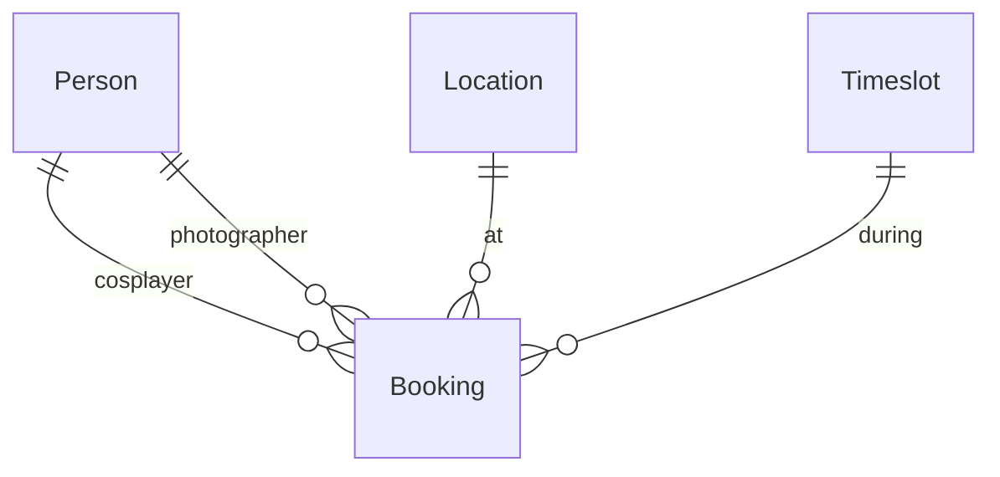
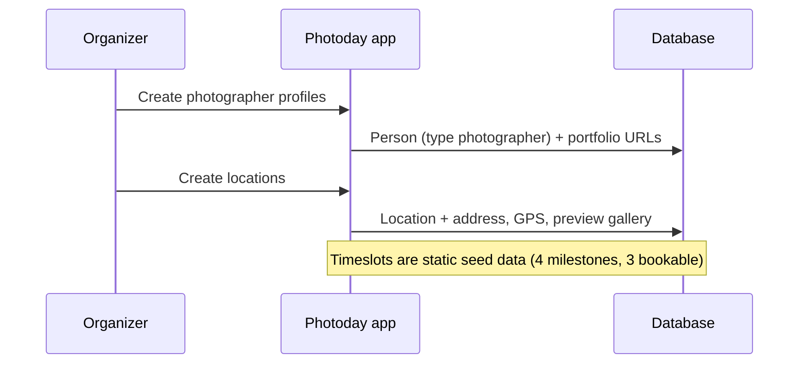
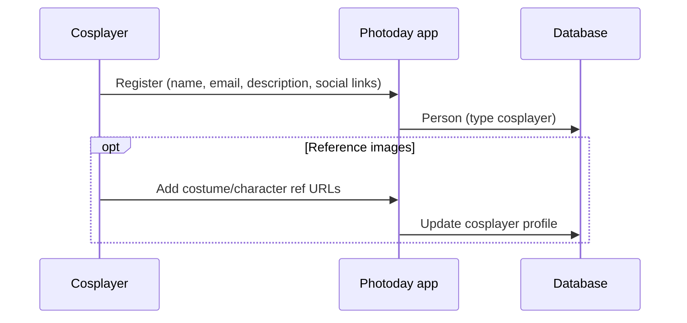
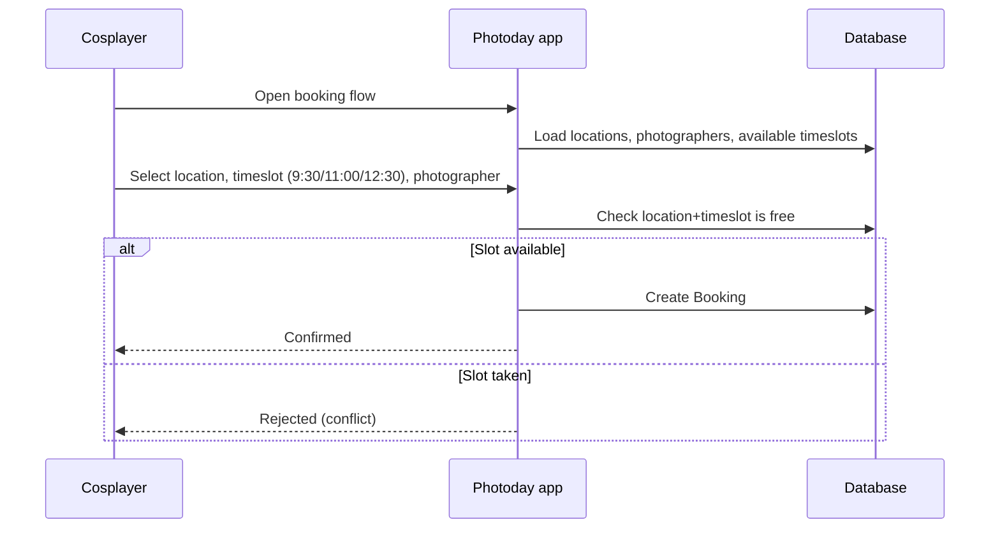

# App Workflow

How MMC Photoday coordinates photographers, cosplayers, locations, and timeslots for Mini Movie Con photoday at `photoday.minimoviecon.sk`.

**Status:** v1 skeleton is live (homepage + placeholder routes). Domain tables and booking flows are defined here but not yet implemented in code.

**Source of truth for entity fields:** [domain-models requirements](../brainstorms/2026-07-06-domain-models-requirements.md)

---

## Product goal

Cosplayers self-book a photo session by choosing:

1. **Location** — where the shoot happens
2. **Timeslot** — when (one of three fixed shoot windows)
3. **Photographer** — who shoots

**Core rule:** at most **one booking per location per shoot timeslot**. A location cannot host two sessions in the same window.

Organizers prepare the catalog (photographers and locations) before booking opens. Cosplayers register themselves and then book.

---

## Actors

| Actor | Role | Profile ownership |
|-------|------|-------------------|
| **Organizer** | Creates photographer profiles and locations; admin access (auth deferred) | Organizer-maintained |
| **Photographer** | Appears as a bookable option; sees their session queue (future) | Organizer creates profile |
| **Cosplayer** | Self-registers, then books sessions | Self-registration |
| **Visitor** | Reads public homepage; no scheduling actions in v1 | — |

---

## Domain model

Four entities power the scheduling flows.

### Person (unified profile)

One table with a `type` discriminator: `photographer`, `cosplayer`, or `organizer`.

| Field | All types | Photographer | Cosplayer | Organizer |
|-------|-----------|--------------|-----------|-----------|
| name, email | required | | | |
| description | optional | | | |
| social links (Instagram, Facebook, Twitter/X, website) | optional | | | |
| portfolio gallery (image URLs) | | optional | — | — |
| reference images (image URLs) | | — | optional | — |

- `email` is unique across all Person records.
- Galleries are ordered URL lists; file upload is deferred.

### Location (bookable spot)

Replaces the earlier "site" terminology.

| Field | Required |
|-------|----------|
| name | yes |
| description, address, GPS (lat/lng) | optional |
| preview gallery (image URLs) | optional |

Organizer creates and edits locations before cosplayers can book.

### Timeslot (static day schedule)

Fixed for the event day — not organizer-configurable.

| Label | Time | Bookable |
|-------|------|----------|
| Gatherup | 9:00 | no — shown on day schedule only |
| First shoot | 9:30 | yes |
| Second shoot | 11:00 | yes |
| Third shoot | 12:30 | yes |

### Booking (session)

Links exactly one of each:

- cosplayer (Person, type cosplayer)
- photographer (Person, type photographer)
- location
- bookable shoot timeslot (9:30, 11:00, or 12:30)

**Constraints:**

- One booking max per **location + timeslot** pair.
- A cosplayer may hold multiple bookings if each uses a different location, timeslot, or both.
- A photographer may appear in multiple bookings across different location-timeslot pairs.



---

## Workflows

### 1. Organizer prepares the event catalog

Runs before booking opens.



**Outcome:** Photographers and locations exist for the cosplayer booking UI.

### 2. Cosplayer self-registers



**Outcome:** Cosplayer identity exists and can be attached to bookings. Authentication mechanism is deferred.

### 3. Cosplayer books a session

Main product flow.



**Outcome:** One booking record ties cosplayer, photographer, location, and timeslot — or the request is rejected if that location-timeslot pair is already booked.

### Day-of schedule (informational)

Visitors and participants see the full timeline including gatherup:

```
09:00  Gatherup          (not bookable)
09:30  First shoot       (bookable)
11:00  Second shoot      (bookable)
12:30  Third shoot       (bookable)
```

---

## App routes

### Implemented (v1 skeleton)

| Route | Purpose |
|-------|---------|
| `/` | Branded homepage |
| `/bookings` | Placeholder — future cosplayer booking flow |
| `/sessions` | Placeholder — future session list / queue |
| `/notifications` | Placeholder — future notifications |
| `/api/health` | Health check (app + MySQL) |

### Planned (scheduling milestone)

| Route | Actor | Maps to workflow |
|-------|-------|------------------|
| Cosplayer registration | Cosplayer | Workflow 2 |
| Booking flow | Cosplayer | Workflow 3 |
| Organizer admin (photographers, locations) | Organizer | Workflow 1 |
| Photographer session queue | Photographer | Read bookings for logged-in photographer |

Exact paths and auth gates will be decided during planning.

---

## Database (current vs target)

**Current** (`src/db/schema.ts`): placeholder `app_health` table only.

**Target** (scheduling milestone): tables backing Person, Location, Timeslot, and Booking per the domain model above. Drizzle ORM + MySQL migrations follow existing project conventions.

---

## Out of scope (for now)

- Authentication and login (cosplayer self-register + organizer admin)
- Image upload — galleries use external URLs
- Booking status lifecycle (cancelled, no-show, etc.)
- Notifications (email, in-app)
- Payment and post-shoot photo delivery
- Multi-day photoday events

---

## Open decisions

Tracked in [domain-models requirements](../brainstorms/2026-07-06-domain-models-requirements.md#outstanding-questions):

- Auth method for cosplayer registration
- Email verification before booking
- Whether all organizer-created photographers are bookable by default
- Booking status enum and cancellation behavior
