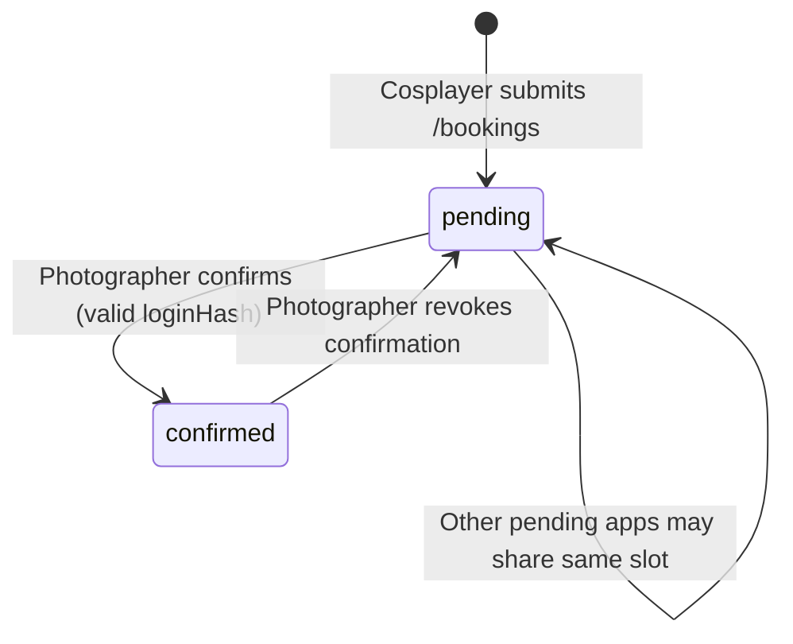
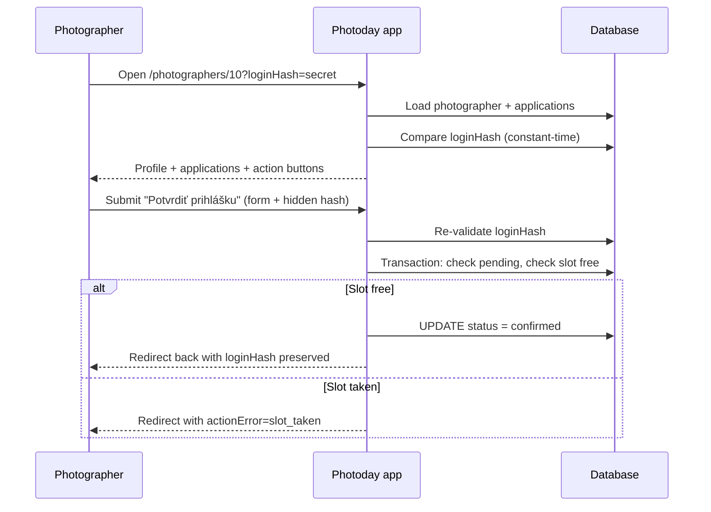

# Photographer application review

How photographers view their profile, see incoming cosplayer applications, and confirm or revoke bookings using a per-photographer `loginHash` query parameter.

**Related:** [app-workflow.md](./app-workflow.md) (domain model), [email.md](./email.md) (cosplayer, organizer, and photographer notifications on submit)

---

## Overview

Cosplayers submit **pending** applications via `/bookings`. Each application is stored as a `bookings` row with `status = pending`. Only **confirmed** bookings hold a location+timeslot pair.

Photographers manage applications on their public detail page when they open a private link that includes `?loginHash=…`. There is no username/password login — the hash acts as a capability URL (shared secret in the query string).

| Actor | What they do | Auth |
|-------|----------------|------|
| **Visitor / cosplayer** | Browse `/photographers` and `/photographers/[id]` read-only | None |
| **Photographer** | Confirm pending applications or revoke confirmed ones | Valid `loginHash` for that photographer |
| **Organizer** | Sets up photographer profiles and distributes login links | Out of app (deferred admin UI) |

---

## URL and access model

### Photographer detail page

| Route | Purpose |
|-------|---------|
| `/photographers` | Public list; cards link to detail pages |
| `/photographers/[id]` | Profile, portfolio, application list |
| `/photographers/[id]?loginHash=XXX` | Same page with management actions enabled |

When `loginHash` matches the photographer's stored `persons.login_hash`, the page shows:

- Banner: *Si prihlásený ako fotograf — môžeš potvrdzovať alebo rušiť prihlášky.*
- **Potvrdiť prihlášku** on each `pending` application
- **Zrušiť potvrdenie** on each `confirmed` application

When the hash is missing or wrong, the page is read-only (no action buttons). Invalid hash on form submit redirects to `/photographers`.

### Setting up login hashes

Each photographer row has an optional unique `login_hash` (varchar 64). **`npm run import:catalog` creates a hash automatically** when a photographer is inserted or when an existing row is re-imported without one.

For photographers already in the database from before this behavior (or to backfill any row still missing a hash):

```bash
npm run photographers:set-login-hashes
```

The script prints ready-to-share URLs, for example:

```
[set] #10 Betty Višváderová
      /photographers/10?loginHash=a1b2c3…
```

Hashes are 48-character hex strings (`randomBytes(24)`). Re-running the script skips photographers that already have a hash.

Organizers distribute the full URL to each photographer (email, chat, etc.). The hash is not shown on public UI. After a cosplayer submits an application, the app also emails the photographer automatically when SMTP is configured — see [email.md](./email.md).

---

## Application lifecycle



### Slot holding rules

| Status | Blocks location+timeslot in booking picker? |
|--------|---------------------------------------------|
| `pending` | No — multiple pending applications may target the same pair |
| `confirmed` | Yes — at most one confirmed booking per location+timeslot |

**Confirm** (`pending` → `confirmed`):

- Application must belong to the authenticated photographer.
- Fails with `BookingConflictError` if another confirmed booking already exists for that location+timeslot.
- User sees: *Toto stanovište a termín sú už obsadené potvrdenou rezerváciou.*

**Revoke** (`confirmed` → `pending`):

- Application must belong to the authenticated photographer.
- Frees the location+timeslot for another confirmation.

There is no `cancelled` or delete status in the current model; revoke returns the application to the pending queue.

---

## Sequence: photographer confirms an application



After any action, the app redirects to `/photographers/[id]?loginHash=…` so the photographer stays authenticated without session cookies.

---

## Data model

### `persons.login_hash`

| Column | Type | Notes |
|--------|------|-------|
| `login_hash` | `varchar(64)` nullable, unique | Set only on `type = photographer` rows used for review |

Migration: `drizzle/0003_aberrant_sage.sql`

### `bookings.status`

| Value | Meaning |
|-------|---------|
| `pending` | Application awaiting photographer confirmation (default on submit) |
| `confirmed` | Photographer approved; slot is held |

Applications are not a separate table — they are `bookings` rows. See `src/db/applications.ts`.

---

## Code map

| Layer | Path | Responsibility |
|-------|------|----------------|
| Schema | `src/db/schema.ts` | `login_hash` on `persons`; `bookingStatuses` |
| Auth check | `src/db/photographers.ts` | `isPhotographerLoginValid()` |
| Compare | `src/lib/secure-compare.ts` | Constant-time hash comparison |
| Confirm / revoke | `src/db/applications.ts` | `confirmApplicationByPhotographer()`, `revokeApplicationByPhotographer()` |
| Server actions | `src/app/photographers/[id]/actions.ts` | Form handlers; redirect with `loginHash` |
| Error copy | `src/app/photographers/[id]/action-errors.ts` | Slovak messages for `actionError` query param |
| Detail page | `src/app/photographers/[id]/page.tsx` | Reads `searchParams.loginHash`; passes `canManage` to UI |
| Application list UI | `src/components/PhotographerApplicationList.tsx` | Client forms for confirm/revoke |
| Hash CLI | `scripts/set-photographer-login-hashes.ts` | `npm run photographers:set-login-hashes` |

---

## Security notes

- **Capability URL, not full auth** — Anyone with the link can manage that photographer's applications. Treat `loginHash` like a password; rotate by updating `persons.login_hash` if leaked.
- **Server-side enforcement** — UI buttons are hidden without a valid hash, but all mutations re-check `isPhotographerLoginValid()` in server actions.
- **Constant-time compare** — `secureCompare()` avoids timing leaks when checking the hash.
- **No hash in public markup** — The stored hash is never rendered; only the value from the URL is echoed in hidden form fields when `canManage` is true.
- **Photographer scope** — Actions verify `booking.photographer_id` matches the page photographer.

Deferred: session cookies, organizer approval UI, email on confirm/revoke, hash rotation UI.

---

## User-visible errors

Query param `actionError` on redirect:

| Code | Slovak message |
|------|----------------|
| `slot_taken` | Toto stanovište a termín sú už obsadené potvrdenou rezerváciou. |
| `invalid_action` | Túto akciu nie je možné vykonať. |
| `unknown` | Akcia zlyhala. Skús to znova. |

---

## Related flows (implemented elsewhere)

| Flow | Route / doc |
|------|-------------|
| Cosplayer submits application | `/bookings` — see [application form plan](../plans/2026-07-11-001-feat-cosplayer-application-form-plan.md) |
| Submit emails | [email.md](./email.md) — cosplayer confirmation, organizer notification, photographer notification with `loginHash` review link |
| Public photographer browse | `/photographers` — [photographers requirements](../brainstorms/2026-07-08-photographers-page-requirements.md) |

---

## Out of scope (current milestone)

- Organizer approve/reject UI
- Email to cosplayer when photographer confirms or revokes
- Photographer login via email/password or OAuth
- Importing `loginHash` from catalog JSON (hashes are generated on import; not editable via JSON)
- Audit log of who confirmed what
