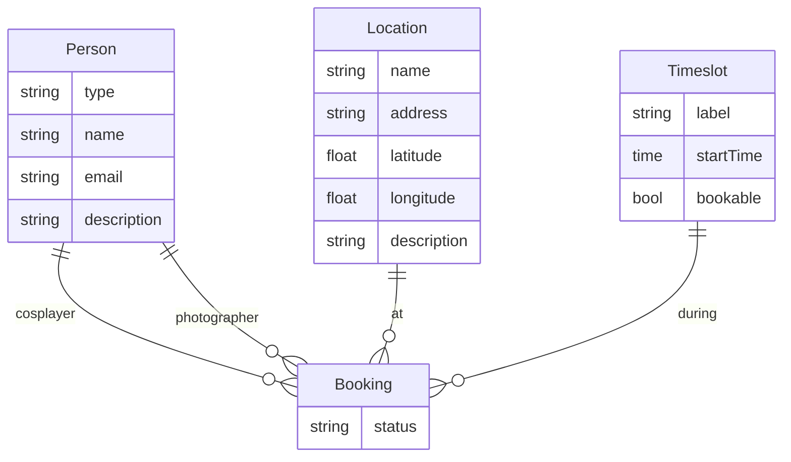

# Photoday Domain Models — Requirements

## Summary

Define the core data models for Mini Movie Con photoday scheduling: a unified **Person** profile with type (photographer, cosplayer, organizer), a **Location** as the bookable photoshoot spot, three fixed shoot **Timeslots** plus a non-bookable gatherup milestone, and a **Booking** linking one cosplayer, one photographer, one location, and one shoot timeslot. Organizer maintains photographer and location records; cosplayers self-register. This document specifies model shape and relationships only — not authentication, UI, or API implementation.

---

## Problem Frame

The photoday hub skeleton (`docs/brainstorms/2026-07-02-photoday-hub-requirements.md`) established the product intent: cosplayers self-book a location, timeslot, and photographer under a one-session-per-slot rule. The database still holds only a placeholder `app_health` table; domain tables were deferred to the scheduling milestone.

Before building booking flows, the team needs agreed entity definitions — what fields each model carries, how they relate, and which constraints the booking layer must enforce. Without this, planning risks inventing incompatible shapes or re-litigating naming (e.g., "site" vs "location").

---

## Key Decisions

- **Unified Person over separate role tables** — Photographer, cosplayer, and organizer share one profile entity with a `type` discriminator. Common fields (name, email, description, social links) live once; type-specific fields attach to the same record.
- **Location replaces "site"** — The bookable photoshoot spot is called **Location** going forward. It is the same concept as "photo site" / fotostanovištia in prior docs, extended with address, GPS coordinates, description, and a preview gallery.
- **Hybrid profile ownership** — Organizer creates and edits photographer profiles and locations. Cosplayers self-register and maintain their own profiles. Organizer-type Person records represent admin users.
- **URL-based galleries** — Photographer portfolios, location preview images, and cosplayer reference photos are ordered lists of image URLs. File upload is deferred.
- **Fixed social-link fields** — Each Person profile exposes optional Instagram, Facebook, Twitter/X, and website fields rather than a free-form link list.
- **Static timeslot schedule** — Shoot timeslots are fixed for the event day. Gatherup at 9:00 is schedule information only; the three bookable slots are 9:30, 11:00, and 12:30.

---

## Actors

- A1. **Cosplayer** — Self-registers a Person profile (type cosplayer), then books a session by choosing location, shoot timeslot, and photographer.
- A2. **Photographer** — Has a Person profile (type photographer) created by the organizer; appears as a bookable option in the cosplayer flow.
- A3. **Organizer** — Creates and edits photographer profiles and locations; holds a Person profile (type organizer) for admin access (auth deferred).
- A4. **Visitor** — Out of scope for this model doc; no new entities.

---

## Requirements

**Person (unified profile)**

- R1. A **Person** record has a required `type` of `photographer`, `cosplayer`, or `organizer`.
- R2. Every Person has required `name` and `email`, and optional `description`.
- R3. Every Person has optional fixed social-link fields: Instagram, Facebook, Twitter/X, and website.
- R4. A Person with type `photographer` may have an ordered **portfolio gallery** — a list of image URLs showcasing their work.
- R5. A Person with type `cosplayer` may have an ordered list of optional **reference image URLs** (costume or character references). Cosplayers do not have a portfolio gallery.
- R6. A Person with type `organizer` uses only the common Person fields; no gallery or reference images.
- R7. `email` is unique across all Person records regardless of type.

**Location (bookable photoshoot spot)**

- R8. A **Location** represents one bookable photoshoot spot for the event.
- R9. Every Location has required `name` and optional `description`, `address`, and GPS coordinates (latitude and longitude).
- R10. Every Location may have an ordered **preview gallery** — a list of image URLs showing the spot.
- R11. Locations are created and edited by the organizer before cosplayers book.

**Timeslot (event schedule)**

- R12. The event day has four named schedule milestones: **Gatherup** at 9:00, **First shoot** at 9:30, **Second shoot** at 11:00, and **Third shoot** at 12:30.
- R13. Only the three shoot timeslots (9:30, 11:00, 12:30) are bookable. Gatherup at 9:00 is informational — displayed on the day schedule but not selectable for booking.
- R14. Timeslots are static and identical for every event day covered by this model; they are not organizer-configurable.

**Booking (session)**

- R15. A **Booking** links exactly one cosplayer (Person type cosplayer), one photographer (Person type photographer), one Location, and one bookable shoot Timeslot.
- R16. At most one Booking may exist for a given Location and bookable Timeslot pair. A second booking attempt for the same pair is rejected.
- R17. A cosplayer may hold multiple Bookings only when each uses a different Location, Timeslot, or both — the constraint is per location-timeslot pair, not per person.
- R18. A photographer may appear in multiple Bookings across different location-timeslot pairs.

---

## Key Flows

- F1. **Organizer publishes photographers and locations**
  - **Trigger:** Organizer prepares the event catalog before booking opens.
  - **Actors:** A3
  - **Steps:** Organizer creates or edits Person records (type photographer) with portfolio galleries and social links. Organizer creates or edits Location records with address, GPS, description, and preview gallery.
  - **Outcome:** Bookable photographers and locations exist for the cosplayer flow.
  - **Covered by:** R4, R7, R8–R11

- F2. **Cosplayer self-registers**
  - **Trigger:** Cosplayer opens registration before or during booking.
  - **Actors:** A1
  - **Steps:** Cosplayer creates a Person record (type cosplayer) with name, email, description, social links, and optional reference images.
  - **Outcome:** Cosplayer identity exists and can be attached to a Booking.
  - **Covered by:** R1–R3, R5, R7

- F3. **Cosplayer books a session**
  - **Trigger:** Cosplayer opens the booking flow.
  - **Actors:** A1
  - **Steps:** Cosplayer selects a Location, a bookable shoot Timeslot (9:30, 11:00, or 12:30), and a Photographer from available options. System creates a Booking if the location-timeslot pair is free; otherwise the request is rejected.
  - **Outcome:** One confirmed Booking tying cosplayer, photographer, location, and timeslot.
  - **Covered by:** R15, R16

---

## Entity Relationships

---

## Acceptance Examples

- AE1. **Happy path booking**
  - **Covers:** R15, R16
  - **Given:** Location "Castle Courtyard" is free at 9:30; photographer Anna and cosplayer Marek both have Person profiles.
  - **When:** Marek books Castle Courtyard, 9:30, with Anna.
  - **Then:** One Booking is created linking Marek, Anna, Castle Courtyard, and the 9:30 timeslot.

- AE2. **Conflict rejection**
  - **Covers:** R16
  - **Given:** Castle Courtyard at 9:30 is already booked (cosplayer Jana + photographer Peter).
  - **When:** Marek attempts to book Castle Courtyard at 9:30 with Anna.
  - **Then:** The booking is rejected; no second Booking exists for that location-timeslot pair.

- AE3. **Gatherup is not bookable**
  - **Covers:** R13
  - **Given:** The day schedule shows Gatherup at 9:00.
  - **When:** A cosplayer views available timeslots for booking.
  - **Then:** Only 9:30, 11:00, and 12:30 appear as selectable options; 9:00 does not.

- AE4. **Same cosplayer, different slots**
  - **Covers:** R17
  - **Given:** Marek already has a Booking at Castle Courtyard 9:30.
  - **When:** Marek books Forest Glade at 11:00 with a different photographer.
  - **Then:** A second Booking is created; Marek holds two Bookings on different location-timeslot pairs.

- AE5. **Photographer in multiple bookings**
  - **Covers:** R18
  - **Given:** Anna is booked at Castle Courtyard 9:30 with Marek.
  - **When:** Jana books Forest Glade at 9:30 with Anna.
  - **Then:** Anna appears in two Bookings at the same timeslot but different locations.

---

## Scope Boundaries

**In scope**

- Person, Location, Timeslot, and Booking entity definitions and field lists
- Type-specific fields on Person (portfolio, reference images)
- Booking uniqueness constraint (one per location per bookable timeslot)
- Static timeslot schedule including non-bookable gatherup
- Hybrid ownership model (organizer-managed vs cosplayer self-registered)

**Deferred for later**

- Authentication, login, and session management for cosplayer self-registration and organizer access
- Image upload and hosting — galleries are URL lists only
- Booking status lifecycle (pending, confirmed, cancelled, no-show)
- Organizer workflow for publishing or unpublishing locations and photographers
- Notifications on booking create or change
- Slovak vs bilingual field labels and UI copy

**Outside this document's identity**

- API endpoint design, database schema DDL, and ORM table definitions (planning artifacts)
- Payment, photo delivery, and post-shoot gallery hosting
- General convention registration or ticketing

---

## Dependencies / Assumptions

- Builds on the photoday hub product intent in `docs/brainstorms/2026-07-02-photoday-hub-requirements.md`.
- The existing skeleton (`src/db/schema.ts`) will gain domain tables during the scheduling milestone; this doc defines what those tables must represent.
- GPS coordinates are stored as latitude and longitude numeric values; map display and geocoding are deferred.
- One event day is modeled; multi-day photoday events are out of scope unless planning extends Timeslot.
- Prior docs used "site" and Slovak "fotostanovištia" — **Location** is the canonical English term going forward.

---

## Outstanding Questions

**Deferred to planning**

- Exact social-link field names and validation (URL format, max length).
- Whether gallery and reference-image URL lists have a maximum count or length per item.
- Booking status enum and whether soft-delete or cancellation is needed in v1.
- How seed data for the four timeslot milestones is stored (lookup table, enum, or config).
- Whether organizer Person records are required before any admin UI ships.

**Resolve before full booking implementation (not blocking model definition)**

- Authentication method for cosplayer self-registration (magic link, password, convention SSO).
- Whether email verification is required before a cosplayer can book.
- Whether photographers must be explicitly marked "available" or all organizer-created photographers are bookable by default.
