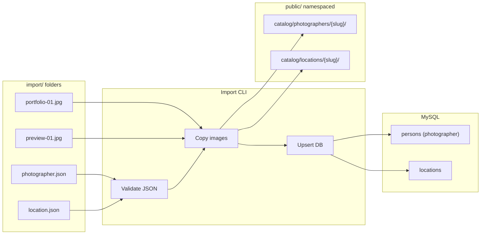

# Catalog Import — Requirements

## Summary

Add file-based import for organizer-managed catalog data: flat `import/photographers` and `import/locations` folders where each entity is one JSON file plus co-located JPEG/PNG images. A CLI command scans those folders, copies referenced images into namespaced paths under `public/`, and upserts `persons` (type photographer) and `locations` records with served gallery URLs. Ship committed example JSON templates for each entity type.

---

## Problem Frame

The photoday hub defines photographers and locations in the domain model (`docs/brainstorms/2026-07-06-domain-models-requirements.md`) with ordered URL galleries, but galleries were deferred as "URL lists only — file upload deferred." Organizers still need a practical way to load real catalog content (names, bios, social links, preview photos) before booking opens.

Manual database entry or ad-hoc SQL does not scale for a small team preparing a convention catalog with partial real data already gathered. A drop-folder workflow lets organizers assemble JSON and images locally, then run a repeatable CLI import that bridges local files to the URL-based schema the app already expects.

---

## Key Decisions

- **Flat import folders with namespaced public copy** — One JSON per entity; images sit flat beside JSON files in `import/photographers` and `import/locations`. On import, images copy into per-entity namespaces under `public/` so served URLs stay collision-free even when multiple entities use the same original filename (e.g. `portfolio-01.jpg`).
- **CLI seed over UI or deploy hook** — Import is triggered explicitly by running a CLI command (e.g. before the event or after catalog edits). It does not run automatically on deploy or `db:migrate`, and there is no admin UI trigger in this scope.
- **Upsert on re-import** — Re-running the CLI updates existing records matched by photographer `email` and location `name`. New JSON files create new records; changed galleries replace stored URL lists without wiping unrelated catalog entries.
- **No orphan cleanup** — When a JSON removes an image from a gallery, previously copied files in `public/` are left in place. Simplicity over storage tidiness.
- **Extend existing domain model** — Import populates fields already defined on `persons` (type `photographer`) and `locations`. It does not introduce new entities or change booking rules.

---

## Actors

- A1. **Organizer / operator** — Places JSON and image files in import folders and runs the CLI to load or refresh catalog data.
- A2. **Import CLI** — Reads import folders, validates JSON, copies images to `public/`, writes or updates database records.
- A3. **Cosplayer / visitor** — Out of scope for import; they consume catalog data after it is loaded.

---

## Requirements

**Import folders**

- R1. The repo provides `import/photographers` and `import/locations` directories for catalog source files.
- R2. Each photographer is defined by exactly one `*.json` file in `import/photographers`.
- R3. Each location is defined by exactly one `*.json` file in `import/locations`.
- R4. Gallery images referenced by a JSON file are JPEG or PNG files stored in the same folder as that JSON (flat layout — no per-entity subfolders in import).
- R5. Image filenames must be unique within each import folder across all entities in that folder. Two JSON files in the same folder cannot reference the same filename for different entities.

**JSON content — photographer**

- R6. A photographer JSON includes required fields `name` and `email`, matching the `persons` table constraints.
- R7. A photographer JSON may include optional `description` and social-link fields: `instagram`, `facebook`, `twitter`, `website`.
- R8. A photographer JSON may include an ordered `portfolio` array listing local image filenames (not URLs) for the portfolio gallery. Order in the array is display order after import.

**JSON content — location**

- R9. A location JSON includes required field `name`.
- R10. A location JSON may include optional `description`, `address`, `latitude`, and `longitude`.
- R11. A location JSON may include an ordered `previewGallery` array listing local image filenames for the preview gallery. Order in the array is display order after import.

**Media handling**

- R12. For each local filename in a gallery array, the import process copies the file from the import folder into a namespaced directory under `public/` derived from the entity (photographer email slug or location name slug).
- R13. After copy, the database stores full served URLs (not local filenames or relative import paths) in `portfolio_urls` for photographers and `preview_gallery_urls` for locations.
- R14. Only files listed in a JSON gallery array are copied. Unreferenced image files in the import folder are ignored.

**CLI behavior**

- R15. A single CLI command imports both folders (photographers and locations) in one run.
- R16. The CLI reports per-file success or failure (which JSON imported, which failed validation, which images were missing).
- R17. If a JSON file fails validation or references a missing image file, that entity is skipped; other valid entities in the same run still import.
- R18. Re-running the CLI upserts: an existing photographer is matched by `email`; an existing location is matched by `name`. Matched records are updated with the latest JSON field values and gallery URLs.

**Example templates**

- R19. The repo includes one committed example photographer JSON in `import/photographers` demonstrating all supported fields and a sample `portfolio` filename list.
- R20. The repo includes one committed example location JSON in `import/locations` demonstrating all supported fields and a sample `previewGallery` filename list.
- R21. Example JSON files use realistic placeholder content suitable as copy-paste templates for real catalog data.

---

## Key Flows

- F1. **Organizer prepares catalog files**
  - **Trigger:** Organizer gathers photographer and location data before booking opens.
  - **Actors:** A1
  - **Steps:** Organizer creates one JSON per photographer/location in the appropriate import folder. Organizer adds JPEG/PNG files beside each JSON, using unique filenames within the folder. Gallery arrays list those filenames in desired display order.
  - **Outcome:** Import folders contain valid source material ready for CLI import.
  - **Covered by:** R1–R5, R6–R11, R19–R21

- F2. **CLI import run**
  - **Trigger:** Organizer runs the catalog import CLI command.
  - **Actors:** A1, A2
  - **Steps:** CLI scans `import/photographers` and `import/locations` for `*.json` files. For each valid JSON, CLI copies referenced images to namespaced `public/` paths, resolves served URLs, and inserts or updates the matching database record. CLI prints a summary of imported, updated, and failed entities.
  - **Outcome:** Photographer and location catalog data exists in the database with gallery URLs pointing at copied `public/` assets.
  - **Covered by:** R12–R18

- F3. **Re-import after catalog edits**
  - **Trigger:** Organizer changes a JSON or swaps gallery images, then re-runs the CLI.
  - **Actors:** A1, A2
  - **Steps:** CLI matches existing records by photographer email or location name and overwrites fields and gallery URL lists. New images copy to the entity's `public/` namespace. Removed gallery entries no longer appear in the database; old copied files may remain on disk.
  - **Outcome:** Database reflects the latest JSON without duplicating entities.
  - **Covered by:** R18, orphan policy in Key Decisions

---

## Visualizations

---

## Acceptance Examples

- AE1. **First-time photographer import**
  - **Covers:** R2, R6–R8, R12–R13, R15
  - **Given:** `import/photographers/anna-kovar.json` with `email`, `name`, and `portfolio: ["hero.jpg"]`, and `hero.jpg` exists beside the JSON.
  - **When:** The organizer runs the import CLI.
  - **Then:** A `persons` record exists with `type` photographer, matching fields, and `portfolio_urls` containing a served URL for the copied `hero.jpg`.

- AE2. **Upsert updates existing photographer**
  - **Covers:** R18
  - **Given:** Anna's photographer record already exists for `anna@example.sk`. Her JSON now has an updated `description` and a new `portfolio` filename list.
  - **When:** The organizer re-runs the import CLI.
  - **Then:** The existing record is updated in place (same `email`, new description and gallery URLs). No duplicate photographer row is created.

- AE3. **Missing image skips entity**
  - **Covers:** R17
  - **Given:** A location JSON references `missing.jpg` which is not present in `import/locations`.
  - **When:** The import CLI runs alongside other valid JSON files.
  - **Then:** That location is reported as failed and skipped. Other valid locations and photographers still import.

- AE4. **Filename collision prevention**
  - **Covers:** R5
  - **Given:** Two photographer JSON files in `import/photographers` both reference a file named `hero.jpg` in their respective `portfolio` arrays, but only one `hero.jpg` exists in the folder.
  - **When:** The import CLI runs.
  - **Then:** At least one entity fails or the collision is detected and reported. The operator must use unique filenames across the folder (documented constraint).

- AE5. **Gallery removal leaves orphan files**
  - **Covers:** orphan policy, R18
  - **Given:** A photographer was previously imported with `old-shot.jpg` in the portfolio. The JSON is edited to remove that filename.
  - **When:** The organizer re-runs the import CLI.
  - **Then:** `portfolio_urls` no longer includes the old image URL. The copied file may still exist under `public/` (orphan acceptable).

---

## Scope Boundaries

**In scope**

- `import/photographers` and `import/locations` folder conventions
- JSON field shapes aligned with existing `persons` (photographer) and `locations` schema
- Local JPEG/PNG gallery references and copy-to-`public/` with namespaced paths
- CLI import command with upsert semantics and per-entity error reporting
- Committed example JSON templates for photographer and location

**Deferred for later**

- Admin UI for triggering import or editing catalog
- Automatic import on deploy or database migration
- Cosplayer import (self-registration remains separate)
- Deleting orphaned `public/` files when galleries shrink on re-import
- External URL support in gallery arrays (import scope is local files only)
- Image optimization, resizing, or format conversion
- Import of timeslots or bookings

**Outside this product's identity**

- General-purpose CMS or media library
- Third-party cloud storage upload pipeline
- Convention-wide registration or ticketing data import

---

## Dependencies / Assumptions

- Builds on domain models in `docs/brainstorms/2026-07-06-domain-models-requirements.md` and tables in `src/db/schema.ts` (`persons`, `locations`).
- Production serves static files from `public/` via nginx/Next.js standalone deploy (see `deploy/nginx.conf.example`).
- Photographer `email` is unique in the database; location `name` is the upsert key for import even though the schema does not enforce name uniqueness — operators should use distinct location names.
- Partial real catalog data exists; example JSONs are templates operators can copy and extend.
- Base URL for constructing served gallery URLs is configured at import time (environment or deploy default).

---

## Outstanding Questions

**Deferred to planning**

- Exact CLI command name and npm script (e.g. `npm run import:catalog`).
- Slug derivation rules from email and location name (character normalization, collision handling).
- How base URL for served images is resolved (env var name, localhost vs production default).
- Whether real import data (non-example JSON and images) is git-tracked or gitignored.
- Validation rules for social links, coordinates, and field max lengths.
- Whether example JSONs ship with placeholder image files or document expected filenames only.

**Resolve before planning**

- None — approach A (flat import + namespaced public copy) is confirmed.
