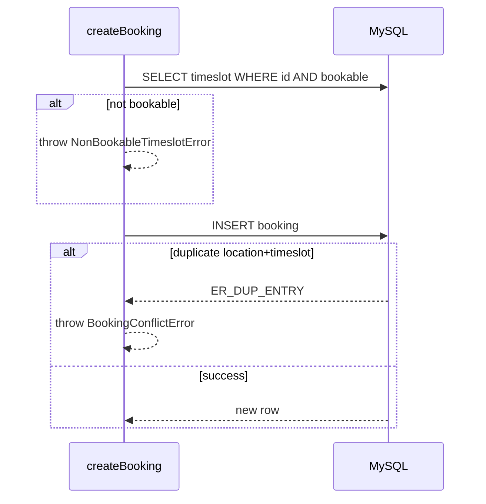

# feat: Domain Models — Drizzle Schema, Migrations, and Booking Constraint

## Summary

Implement the photoday scheduling data layer in Drizzle + MySQL: unified **Person** (type discriminator), **Location**, seeded **Timeslot** milestones, and **Booking** with a database-enforced one-booking-per-location-per-timeslot rule. Includes a thin `createBooking` data-access function so the conflict constraint is testable before UI or API routes exist.

---

## Problem Frame

The photoday hub skeleton ships with only an `app_health` placeholder table. Domain models are defined in `docs/brainstorms/2026-07-06-domain-models-requirements.md` and summarized in `docs/architecture/app-workflow.md`, but no schema, migrations, or booking enforcement exist yet. This plan lands the persistence layer so future booking UI and API work can build on typed, constrained tables rather than inventing schema during feature development.

---

## Requirements

**Schema — Person**

- R1. A `persons` table stores profiles with required `type` (`photographer` | `cosplayer` | `organizer`), `name`, and `email`; optional `description`.
- R2. Optional fixed social-link columns on Person: `instagram`, `facebook`, `twitter`, `website` (nullable strings).
- R3. Photographer profiles may store an ordered portfolio as a JSON array of image URL strings.
- R4. Cosplayer profiles may store optional reference images as a JSON array of URL strings; no portfolio column.
- R5. `email` is unique across all Person rows (see origin R7).

**Schema — Location**

- R6. A `locations` table stores bookable photoshoot spots with required `name`; optional `description`, `address`, `latitude`, `longitude`.
- R7. Locations may store an ordered preview gallery as a JSON array of image URL strings (see origin R10).

**Schema — Timeslot**

- R8. A `timeslots` table holds the four static day milestones: Gatherup 9:00 (not bookable), First shoot 9:30, Second shoot 11:00, Third shoot 12:30 (see origin R12–R14).
- R9. Each timeslot row has `label`, `start_time`, and `bookable` (boolean).

**Schema — Booking**

- R10. A `bookings` table links `cosplayer_id`, `photographer_id`, `location_id`, and `timeslot_id` with foreign keys to `persons`, `persons`, `locations`, and `timeslots` respectively (see origin R15).
- R11. At most one booking per `location_id` + `timeslot_id` pair — enforced by a unique composite index (see origin R16, AE2).
- R12. Bookings include a `status` column defaulting to `confirmed`; lifecycle transitions (cancelled, no-show) are deferred.

**Data access**

- R13. A `createBooking` function accepts cosplayer, photographer, location, and timeslot IDs, validates that the timeslot is bookable, and inserts a booking or returns a typed conflict error when the location-timeslot pair is taken (see origin R16, AE1, AE2).

**Migrations and tooling**

- R14. Drizzle schema changes produce a new migration under `drizzle/` via `npm run db:generate`; applied with `npm run db:migrate`.
- R15. Timeslot seed data ships in the same migration (or a dedicated follow-up migration in the same PR) so fresh databases have all four milestones without manual SQL.

**Tests**

- R16. Unit tests cover schema type exports, timeslot seed constants, `createBooking` happy path, conflict rejection, and rejection when targeting a non-bookable timeslot (gatherup).

---

## Key Technical Decisions

- **JSON columns for galleries and social links on the parent row**: Ordered URL lists and optional social fields live on `persons` and `locations` as JSON or varchar columns. Normalized `gallery_images` tables are deferred — no per-image queries are needed yet, and JSON keeps the first milestone small (see origin deferred gallery upload).
- **Timeslots as a seeded lookup table, not code constants**: Bookings reference `timeslots.id` via foreign key. The four milestones are inserted by migration/seed SQL so integrity is enforced at the database layer and bookable vs informational is queryable via `bookable` (origin R13–R14).
- **Thin `createBooking` data-access function**: Schema-only would leave the unique constraint untested until the booking UI ships. A small function in `src/db/bookings.ts` wraps insert, checks `bookable`, and maps MySQL duplicate-key errors to a `BookingConflictError` — testable with mocked `db` following `src/app/api/health/route.test.ts` patterns.
- **Minimal `status` on bookings now**: Single default `confirmed` avoids a migration later when cancellation is designed; no status transition logic in this milestone (origin outstanding question on lifecycle).
- **Person type as MySQL enum or varchar with TS union**: Prefer Drizzle `mysqlEnum` for `person.type` and `booking.status` where Drizzle Kit supports it; keeps invalid types out of the database without application-only validation.
- **Retain `app_health`**: Do not drop the placeholder table; domain tables are additive alongside it.

---

## High-Level Technical Design

```mermaid
erDiagram
  persons ||--o{ bookings : "cosplayer_id"
  persons ||--o{ bookings : "photographer_id"
  locations ||--o{ bookings : "location_id"
  timeslots ||--o{ bookings : "timeslot_id"

  persons {
    int id PK
    enum type
    string name
    string email UK
    json portfolio_urls
    json reference_image_urls
  }

  locations {
    int id PK
    string name
    decimal latitude
    decimal longitude
    json preview_gallery_urls
  }

  timeslots {
    int id PK
    string label
    time start_time
    bool bookable
  }

  bookings {
    int id PK
    int cosplayer_id FK
    int photographer_id FK
    int location_id FK
    int timeslot_id FK
    enum status
    UK location_id_timeslot_id
  }
```

**Booking creation flow:**



---

## Scope Boundaries

**In scope**

- Drizzle table definitions for Person, Location, Timeslot, Booking
- Generated migration(s) and timeslot seed data
- `createBooking` data-access function with typed errors
- Vitest tests for booking logic and schema exports
- Brief README note pointing to `docs/architecture/app-workflow.md`

**Deferred for later** (from origin)

- Authentication and cosplayer self-registration flow
- API routes and UI for booking, registration, organizer admin
- Image upload pipeline
- Booking status transitions beyond default `confirmed`
- Notifications

### Deferred to Follow-Up Work

- Organizer CRUD API for persons and locations
- Cosplayer registration endpoint
- Booking list/queue views for photographers

---

## Implementation Units

### U1. Define Person and Location Drizzle tables

**Goal:** Add `persons` and `locations` table definitions with all fields from the domain model.

**Requirements:** R1–R7

**Dependencies:** none

**Files:**
- Modify: `src/db/schema.ts`
- Create: `src/db/schema.test.ts`

**Approach:** Extend `schema.ts` with `persons` and `locations` tables. Use `mysqlEnum` for `person.type`. Store `portfolio_urls` and `reference_image_urls` on `persons` as nullable JSON columns (photographer uses portfolio; cosplayer uses references; organizer leaves both null). Store `preview_gallery_urls` on `locations` as nullable JSON. GPS as `decimal` latitude/longitude nullable columns. Add unique index on `persons.email`. Export inferred TypeScript types (`Person`, `NewPerson`, `Location`, `NewLocation`) via `$inferSelect` / `$inferInsert`.

**Patterns to follow:** Existing `app_health` table style in `src/db/schema.ts`; Drizzle mysql-core imports already in use.

**Test scenarios:**
- Schema exports `persons` and `locations` table objects
- Person type union includes `photographer`, `cosplayer`, `organizer`
- Inferred `NewPerson` type accepts optional gallery JSON fields

**Verification:** `npm run db:generate` succeeds without errors; `schema.test.ts` passes.

---

### U2. Define Timeslot and Booking tables with uniqueness constraint

**Goal:** Add `timeslots` and `bookings` tables; enforce one booking per location per timeslot at the database level.

**Requirements:** R8–R12

**Dependencies:** U1

**Files:**
- Modify: `src/db/schema.ts`
- Modify: `src/db/schema.test.ts`

**Approach:** Add `timeslots` with `label`, `start_time` (time or varchar `HH:MM` — pick one and stay consistent), and `bookable` boolean. Add `bookings` with FK references to `persons` (twice), `locations`, and `timeslots`. Add `status` enum defaulting to `confirmed`. Create unique index on `(location_id, timeslot_id)`. Export booking types.

**Test scenarios:**
- Schema exports `timeslots` and `bookings` table objects
- Bookings table defines a unique constraint on location + timeslot (inspect index name or column list in schema metadata test)

**Verification:** `npm run db:generate` produces migration SQL containing `bookings` and unique index; tests pass.

---

### U3. Generate migration and seed static timeslots

**Goal:** Produce and apply a migration that creates all domain tables and inserts the four timeslot milestones.

**Requirements:** R14, R15

**Dependencies:** U2

**Files:**
- Create: `drizzle/0001_*.sql` (generated name)
- Modify: `drizzle/meta/_journal.json` (generated)
- Create: `src/db/seed-timeslots.ts` (optional helper exporting seed constants for tests)
- Create: `src/db/seed-timeslots.test.ts`

**Approach:** Run `npm run db:generate` after U2 schema is complete. Review generated SQL. If Drizzle does not auto-seed, append INSERT statements for the four timeslots to the migration (or add a small `src/db/seed-timeslots.ts` executed in migration via raw SQL in the migration file). Export named constants `TIMESLOT_GATHERUP`, `TIMESLOT_FIRST`, etc. with expected labels and `bookable` flags for tests. Document in README that `npm run db:migrate` applies schema + seeds.

**Test scenarios:**
- Seed constants define exactly four timeslots
- Gatherup timeslot has `bookable: false`; three shoot slots have `bookable: true`
- Start times match 9:00, 9:30, 11:00, 12:30

**Verification:** `npm run db:migrate` succeeds against a dev database; `seed-timeslots.test.ts` passes.

---

### U4. Implement createBooking data-access function

**Goal:** Provide a typed function to create bookings that enforces bookable timeslots and surfaces location-timeslot conflicts.

**Requirements:** R13

**Dependencies:** U2, U3

**Files:**
- Create: `src/db/bookings.ts`
- Create: `src/db/bookings.test.ts`

**Approach:** Export `createBooking({ cosplayerId, photographerId, locationId, timeslotId })`. Before insert, load timeslot by id; if missing or `bookable === false`, throw `NonBookableTimeslotError`. Attempt insert; on MySQL duplicate entry (errno 1062), throw `BookingConflictError`. Return the inserted booking row on success. Keep function free of HTTP concerns — pure data layer.

**Patterns to follow:** Mock `@/db` in tests the same way as `src/app/api/health/route.test.ts`.

**Test scenarios:**
- Covers AE1. Happy path: valid bookable timeslot and free location-timeslot pair returns new booking
- Covers AE2. Conflict: insert throws duplicate key error, function throws `BookingConflictError`
- Non-bookable timeslot (gatherup): throws `NonBookableTimeslotError` without attempting insert
- Missing timeslot id: throws `NonBookableTimeslotError` or dedicated not-found error

**Verification:** `bookings.test.ts` passes with all scenarios green.

---

### U5. Documentation and integration smoke check

**Goal:** Update project docs so implementers know the schema milestone landed and how to migrate.

**Requirements:** R14 (documented workflow)

**Dependencies:** U3, U4

**Files:**
- Modify: `README.md`
- Modify: `src/db/schema.ts` (update top-of-file comment listing domain tables)

**Approach:** Replace the "deferred domain tables" comment in `schema.ts` with a brief list of current tables. Add a README subsection under database setup noting domain tables, timeslot seeds, and pointer to `docs/architecture/app-workflow.md`. Run full `npm test` and `npm run lint` as final gate.

**Test expectation:** none — documentation and comment updates only.

**Verification:** README mentions domain schema; `npm test` and `npm run lint` pass.

---

## System-Wide Impact

- **Database:** New tables are additive; existing `app_health` and `/api/health` continue to work. Health check does not need to query domain tables in this milestone.
- **Migrations:** Deploy process must run `npm run db:migrate` after deploy when this ships — note in README; no automated deploy hook change in this plan.
- **Future API routes:** `createBooking` becomes the single insertion point for booking conflicts; API layers should not bypass it with raw inserts.

---

## Open Questions

**Deferred to implementation**

- Exact varchar lengths for social URLs and gallery JSON max size
- Whether `start_time` uses MySQL `TIME` or a `varchar(5)` `HH:MM` string for simpler seeding
- Whether seed IDs for timeslots are fixed integers (1–4) for stable test fixtures

**Resolve before booking UI (not blocking this plan)**

- Authentication for cosplayer self-registration (origin outstanding)
- Email verification before booking

---

## Sources & Research

- Origin requirements: `docs/brainstorms/2026-07-06-domain-models-requirements.md`
- Architecture workflow: `docs/architecture/app-workflow.md`
- Existing Drizzle setup: `src/db/schema.ts`, `src/db/index.ts`, `drizzle.config.ts`
- Test mocking pattern: `src/app/api/health/route.test.ts`
- Prior skeleton plan (patterns): `docs/plans/2026-07-02-001-feat-photoday-hub-skeleton-plan.md`
