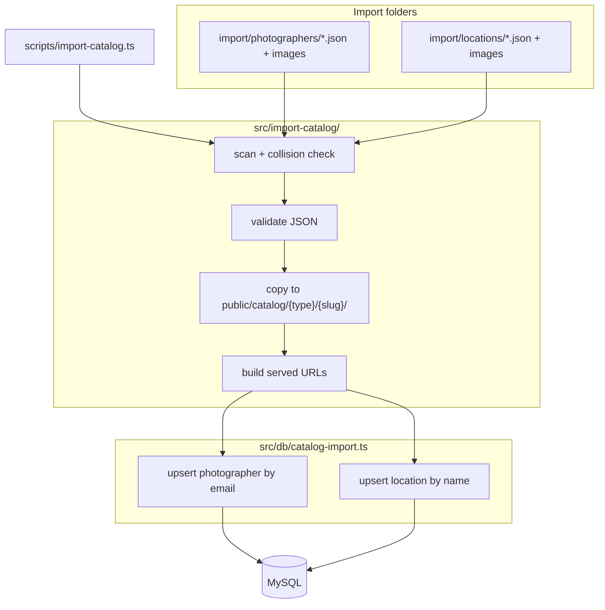

# feat: Catalog Import — File-Based Photographer and Location Seeding

## Summary

Add flat `import/photographers` and `import/locations` folders with one JSON file per entity plus co-located JPEG/PNG gallery images. A `npm run import:catalog` CLI scans both folders, copies referenced images into namespaced paths under `public/catalog/`, and upserts `persons` (type `photographer`) and `locations` rows with full served gallery URLs. Ship committed example JSON templates and tiny placeholder images; gitignore operator-added catalog files and generated `public/catalog/` assets.

---

## Problem Frame

Domain tables and booking logic exist (`src/db/schema.ts`, `src/db/bookings.ts`), but organizers have no workflow to load photographer and location catalog content with local images. The brainstorm (`docs/brainstorms/2026-07-07-catalog-import-requirements.md`) defines a drop-folder + CLI import bridge from local files to the URL-based gallery columns the schema already expects. This plan implements that bridge without admin UI, deploy hooks, or schema changes.

---

## Requirements

**Import folders and templates**

- R1. Repo provides `import/photographers` and `import/locations` with `.gitkeep` or committed example files so directories exist after clone (origin R1).
- R2. One `*.json` file per photographer and per location in the respective folders (origin R2–R3).
- R3. Gallery images are JPEG/PNG files co-located flat in the same folder as the JSON (origin R4).
- R4. Committed example photographer and location JSON demonstrate all supported fields with realistic placeholder Slovak-friendly content (origin R19–R21).
- R5. Operator-added JSON and image files in import folders are gitignored; only committed `example-*.json` and their referenced placeholder images are tracked.

**JSON shape and validation**

- R6. Photographer JSON requires `name` and `email`; optional `description`, `instagram`, `facebook`, `twitter`, `website`, and ordered `portfolio` filename array (origin R6–R8).
- R7. Location JSON requires `name`; optional `description`, `address`, `latitude`, `longitude`, and ordered `previewGallery` filename array (origin R9–R11).
- R8. Validation enforces schema column max lengths (`varchar` 255/512) and rejects unknown top-level keys.
- R9. Gallery arrays accept only `.jpg`, `.jpeg`, `.png` filenames (case-insensitive extension); no URLs in v1 (origin deferred external URLs).
- R10. Pre-import scan detects filename collisions: if two JSON files in the same folder list the same gallery filename, both entities fail with a clear error (origin R5, AE4).

**Media and URLs**

- R11. Referenced images copy to `public/catalog/photographers/{slug}/` or `public/catalog/locations/{slug}/` preserving original filenames (origin R12).
- R12. Database stores absolute served URLs built from `CATALOG_BASE_URL` + `/catalog/...` path (origin R13).
- R13. Unreferenced image files in import folders are ignored (origin R14).
- R14. `public/catalog/` is gitignored; copied assets are deploy/runtime artifacts.

**CLI and database**

- R15. Single command `npm run import:catalog` imports both folders in one run (origin R15).
- R16. CLI prints per-file outcomes: created, updated, skipped, and failure reason (origin R16).
- R17. Invalid JSON or missing referenced image skips that entity; other entities still import (origin R17, AE3).
- R18. Upsert photographers by `email`, locations by `name`; re-run updates fields and gallery URL lists without duplicating rows (origin R18, AE2).
- R19. Re-import does not delete removed images from `public/` (origin AE5, orphan policy).

**Tests and docs**

- R20. Unit tests cover slug derivation, JSON validation, filename collision detection, image copy paths, URL building, and upsert matching — with filesystem and DB layers testable in isolation.
- R21. README documents import workflow, env vars, example file names, filename-uniqueness rule, and that import is separate from `db:migrate`.

---

## Key Technical Decisions

- **TypeScript CLI via `tsx`**: Add `tsx` as a devDependency and run `scripts/import-catalog.ts` from `npm run import:catalog`. Matches the repo's TypeScript-first stack without a separate compile step; mirrors how Vitest already runs TS directly.
- **`CATALOG_BASE_URL` env var**: New variable in `.env.example`, defaulting to `http://localhost:3002` when unset. Production operators set `https://photoday.minimoviecon.sk` before import so stored gallery URLs match the public site (origin assumption on base URL).
- **Slug derivation**: Lowercase; replace runs of non-alphanumeric characters with a single hyphen; trim leading/trailing hyphens. Photographer slug from full email with `@` → `-at-` (e.g. `anna@example.sk` → `anna-at-example-sk`). Location slug from `name`. Slug collisions within a folder type fail that entity with an explicit error.
- **Split pure import logic from DB upserts**: Pure functions in `src/import-catalog/` (parse, validate, scan, copy, build URLs); Drizzle upserts in `src/db/catalog-import.ts` following `src/db/bookings.ts` style. Keeps filesystem tests fast without MySQL.
- **Example files named `example-photographer.json` / `example-location.json`**: Predictable gitignore exceptions (`!import/**/example-*.json`, `!import/**/example-*.{jpg,png}`) so operators copy templates without fighting ignore rules.
- **No schema migration**: Import writes to existing `persons` and `locations` columns only; `type` is always `photographer` for person imports.
- **Exit code 1 on any entity failure**: Partial success is allowed, but the process exits non-zero when one or more entities failed so deploy scripts can detect incomplete imports.

---

## High-Level Technical Design



**Per-entity pipeline**

1. Read all `*.json` in each folder; build filename → referencing JSON map for collision detection.
2. For each JSON: validate shape and field lengths; verify every gallery filename exists on disk and extension is allowed.
3. Derive slug; reject if slug already used by another JSON in the same folder this run.
4. Copy each referenced image to `public/catalog/{photographers|locations}/{slug}/{filename}` (overwrite if re-import).
5. Build URL list from `CATALOG_BASE_URL`.
6. `INSERT` or `UPDATE` via Drizzle; match photographer by `email` + `type = photographer`, location by `name`.

---

## Output Structure

```text
import/
  photographers/
    example-photographer.json
    example-portfolio-01.jpg
  locations/
    example-location.json
    example-preview-01.jpg
public/
  catalog/                    # gitignored; created by import
scripts/
  import-catalog.ts
src/
  import-catalog/
    types.ts
    slug.ts
    validate.ts
    scan.ts
    copy-images.ts
    build-urls.ts
    report.ts
  db/
    catalog-import.ts
  import-catalog.test.ts        # or colocated *.test.ts per module
```

---

## Implementation Units

### U1. Import folders, gitignore, and example templates

**Goal:** Establish the on-disk conventions operators and the CLI depend on.

**Requirements:** R1, R4, R5, R14

**Dependencies:** None

**Files:**
- Create: `import/photographers/example-photographer.json`
- Create: `import/locations/example-location.json`
- Create: tiny placeholder JPEG/PNG files referenced by examples
- Modify: `.gitignore`
- Modify: `.env.example`

**Approach:** Example photographer JSON includes all optional fields (`description`, social links, `portfolio` with two filenames). Example location JSON includes `address`, coordinates, and `previewGallery`. Add gitignore rules for `public/catalog/`, `import/**/*.json` with `!import/**/example-*.json`, and image globs with exceptions for `example-*` assets. Add `CATALOG_BASE_URL` to `.env.example` with comment showing production value.

**Patterns to follow:** Realistic placeholder names aligned with brainstorm acceptance examples (Anna Kovář, Castle Courtyard-style location).

**Test scenarios:**
- Test expectation: none — scaffolding and static templates only.

**Verification:** Example JSON files parse as valid JSON; gitignore rules allow examples while ignoring hypothetical `anna-kovar.json`.

---

### U2. Import domain module — types, slug, validation, collision scan

**Goal:** Pure functions that turn folder contents into validated, collision-free entity records ready for copy/upsert.

**Requirements:** R6–R10

**Dependencies:** U1

**Files:**
- Create: `src/import-catalog/types.ts`
- Create: `src/import-catalog/slug.ts`
- Create: `src/import-catalog/validate.ts`
- Create: `src/import-catalog/scan.ts`
- Create: `src/import-catalog/slug.test.ts`
- Create: `src/import-catalog/validate.test.ts`
- Create: `src/import-catalog/scan.test.ts`

**Approach:** Export `PhotographerImport` and `LocationImport` types matching JSON field names. `slugFromEmail`, `slugFromName` implement normalization rules from KTDs. `validatePhotographerJson` / `validateLocationJson` return typed result or structured errors. `scanImportFolder(dir)` returns JSON file list plus collision map; entities sharing a gallery filename across different JSON files are marked failed before per-file validation runs.

**Execution note:** Implement validation and scan test-first — they encode most edge-case behavior.

**Test scenarios:**
- Covers AE4. Slug: `Anna@Example.SK` → `anna-at-example-sk`
- Slug: `Castle Courtyard` → `castle-courtyard`
- Valid photographer JSON passes; missing `email` fails
- `portfolio` entry `not-a-url.jpg` passes; `http://evil.com/x.jpg` fails
- Field over 255 chars fails with field name in error
- Two JSON files both listing `hero.jpg` → both marked collision failure
- Unknown top-level key rejected

**Verification:** All unit tests pass; no filesystem writes in this unit.

---

### U3. Image copy and URL building

**Goal:** Copy validated gallery files into namespaced `public/` paths and produce served URL strings.

**Requirements:** R11–R13, R19

**Files:**
- Create: `src/import-catalog/copy-images.ts`
- Create: `src/import-catalog/build-urls.ts`
- Create: `src/import-catalog/copy-images.test.ts`
- Create: `src/import-catalog/build-urls.test.ts`

**Dependencies:** U2

**Approach:** `copyGalleryImages({ importDir, entityType, slug, filenames })` ensures target dir exists, copies each file with `fs.copyFile`, overwrites on re-import. `buildGalleryUrls(baseUrl, entityType, slug, filenames)` returns strings like `{base}/catalog/photographers/anna-at-example-sk/hero.jpg` with normalized base (no trailing slash). Use temp directories in tests.

**Test scenarios:**
- Copies `hero.jpg` to `public/catalog/photographers/test-slug/hero.jpg`
- Re-copy overwrites existing destination file
- Missing source file returns error without partial copy for that entity
- URL builder strips trailing slash from base URL
- Two different slugs with same filename produce distinct URLs (namespacing)

**Verification:** Filesystem tests pass using Vitest temp dirs; no DB access.

---

### U4. Database upsert layer

**Goal:** Insert or update photographer and location rows from validated import records.

**Requirements:** R18

**Dependencies:** U2

**Files:**
- Create: `src/db/catalog-import.ts`
- Create: `src/db/catalog-import.test.ts`

**Approach:** `upsertPhotographer(record)` selects by `email` where `type = 'photographer'`; updates or inserts with `portfolioUrls`. `upsertLocation(record)` selects by `name`; updates or inserts with `previewGalleryUrls`. Return `{ action: 'created' | 'updated', id }`. Mock `db` in tests following `src/db/bookings.test.ts` vi.mock pattern.

**Test scenarios:**
- Covers AE2. New email → insert with `type: photographer`
- Existing email → update description and `portfolioUrls`; same row id
- New location name → insert
- Existing location name → update gallery URLs
- Photographer upsert never changes `type` on existing row

**Verification:** Tests pass with mocked Drizzle; no live MySQL required in unit tests.

---

### U5. CLI orchestration and npm script

**Goal:** Wire scan → validate → copy → upsert for both folders with operator-friendly reporting.

**Requirements:** R15–R17, R19

**Dependencies:** U2, U3, U4

**Files:**
- Create: `scripts/import-catalog.ts`
- Create: `src/import-catalog/report.ts`
- Create: `src/import-catalog/run-import.ts` (orchestrator callable from CLI and tests)
- Create: `src/import-catalog/run-import.test.ts`
- Modify: `package.json` (add `tsx` devDependency, `"import:catalog": "tsx scripts/import-catalog.ts"`)

**Approach:** `runCatalogImport({ rootDir, baseUrl, db })` processes photographers then locations, collects `ImportResult[]` with status `created | updated | skipped | failed` and message. CLI loads `DATABASE_URL` and `CATALOG_BASE_URL` from env (dotenv not required if operator exports vars — document in README). Print summary table to stdout; `process.exit(1)` if any `failed`. Integration-style test of `runCatalogImport` uses temp import/public dirs and mocked DB.

**Test scenarios:**
- Covers AE1. Valid photographer folder → `created` result, copy + upsert called
- Covers AE3. One bad JSON + one good JSON → one failed, one created; exit code 1
- Covers AE5. Re-import with shorter portfolio → upsert receives fewer URLs (orphan file not deleted)
- Empty folder → zero results, exit 0
- Missing `DATABASE_URL` → clear error before DB access

**Verification:** `npm run import:catalog` runs against example files when MySQL is up; prints created/updated summary.

---

### U6. Documentation and README integration

**Goal:** Operators can discover and run import without reading the plan.

**Requirements:** R21

**Dependencies:** U1, U5

**Files:**
- Modify: `README.md`

**Approach:** Add **Catalog import** subsection after domain schema: folder layout, copy example templates, add images with unique filenames, set `CATALOG_BASE_URL`, run `npm run import:catalog`. Note import is idempotent upsert, separate from `db:migrate`. Mention production deploy must copy `public/catalog/` to standalone output alongside existing `public/` copy step.

**Test scenarios:**
- Test expectation: none — documentation only.

**Verification:** README steps are accurate against implemented command and paths.

---

## Scope Boundaries

**In scope**

- Everything in Requirements R1–R21 above

**Deferred for later** (carried from origin)

- Admin UI import trigger
- Auto-import on deploy or migrate
- Cosplayer import
- Orphan file cleanup on gallery shrink
- External URL entries in gallery arrays
- Image optimization or format conversion

### Deferred to Follow-Up Work

- **nginx direct static serving of `/catalog/`** — Today assets are served via Next.js `public/`; if catalog images grow large, a dedicated nginx `location /catalog/` alias could be added later. Not required for v1.
- **Location name unique constraint in DB** — Import upserts by name in application logic; a DB unique index on `locations.name` could be a separate migration if duplicate names become a problem.

**Outside this product's identity**

- CMS, cloud upload pipeline, convention registration import (from origin)

---

## System-Wide Impact

- **Operators:** New pre-event step — edit import folders, run `npm run import:catalog`, ensure `public/catalog/` is deployed to production (README already documents copying `public/` into standalone build).
- **Database:** Adds rows to `persons` and `locations`; no migration. Re-import updates existing rows matched by email/name.
- **Deploy:** `public/catalog/` must survive deploy artifact copy (`cp -r public .next/standalone/public`). Generated assets are not in git.
- **Env:** New `CATALOG_BASE_URL`; import requires live `DATABASE_URL` like other DB scripts.

---

## Risks and Dependencies

| Risk | Mitigation |
|------|------------|
| Wrong `CATALOG_BASE_URL` stores broken gallery URLs | Document production value in README and `.env.example`; validation could warn when base URL is localhost in production (optional, defer if noisy) |
| Flat-folder filename collisions confuse operators | Fail fast with explicit collision message naming both JSON files (AE4) |
| Location name upsert updates wrong row if names differ only by case | Document distinct names; slug/normalize comparison uses exact `name` match via Drizzle `eq` — operators should use consistent casing |
| Large binary images committed accidentally | Gitignore import media except `example-*` placeholders |

**Prerequisites:** Domain schema migrated (`npm run db:migrate`); `DATABASE_URL` configured.

---

## Open Questions

**Deferred to implementation**

- Whether to add a `--dry-run` flag (not in origin; skip unless implementer finds it trivial during U5)
- Exact placeholder image dimensions for examples (1×1 PNG is sufficient)

**Resolved in this plan**

- CLI name: `npm run import:catalog`
- Base URL: `CATALOG_BASE_URL`, default `http://localhost:3002`
- Git tracking: examples only; operator data gitignored
- Example images: ship tiny committed placeholders so example import works

---

## Sources and Research

- Origin: `docs/brainstorms/2026-07-07-catalog-import-requirements.md`
- Domain schema: `src/db/schema.ts`
- Data-access pattern: `src/db/bookings.ts`, `src/db/bookings.test.ts`
- Timeslot seed precedent: `drizzle/0001_luxuriant_mentor.sql` INSERTs, `src/db/seed-timeslots.ts`
- Deploy static assets: `README.md` standalone `public/` copy; `deploy/nginx.conf.example` proxies all paths to Next.js
