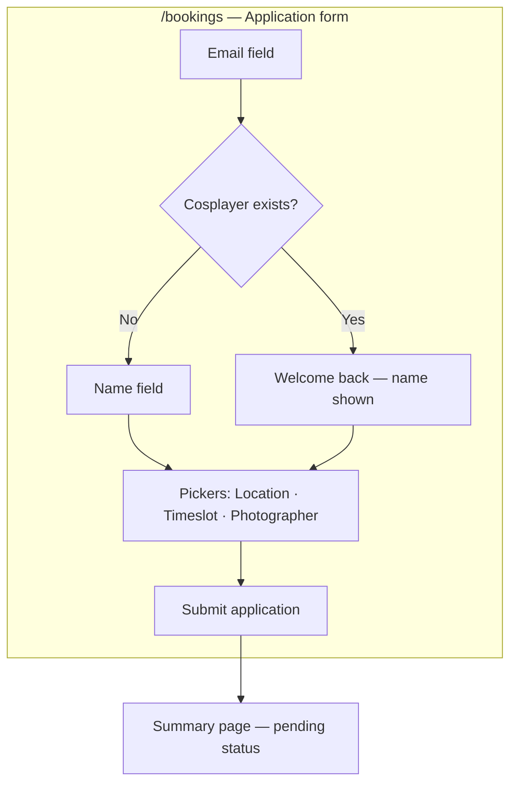
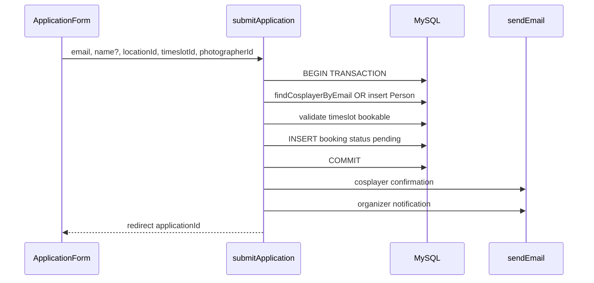
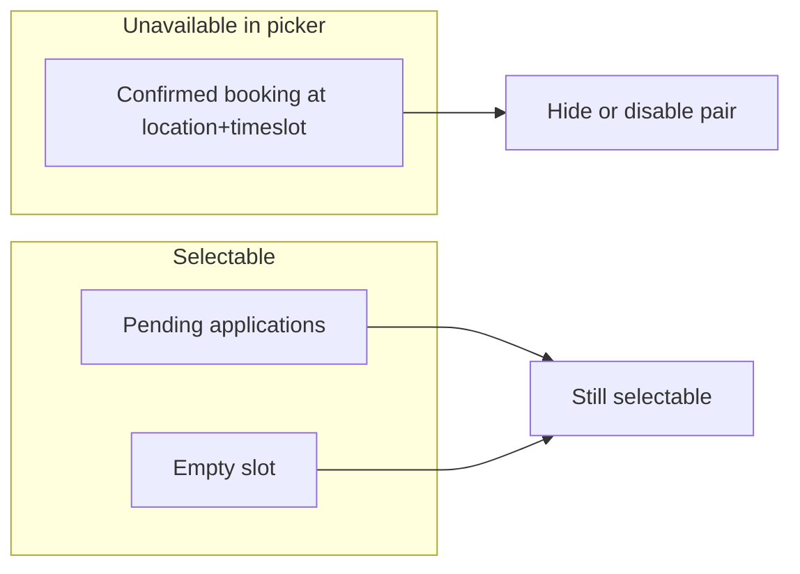

# Cosplayer Application Form - Plan

## Goal Capsule

- **Objective:** Let cosplayers submit a photoshoot application — choosing location, timeslot, and photographer — with first-time profile creation and email notifications, without instant slot confirmation.
- **Product authority:** Requirements-only brainstorm confirmed 2026-07-11; extends domain intent in `docs/brainstorms/2026-07-06-domain-models-requirements.md` with application semantics (pending status, confirm-only slot hold).
- **Open blockers:** None.

---

## Product Contract

**Product Contract preservation:** unchanged — planning resolves deferred schema and UX questions below without altering R/A/F/AE scope.

### Summary

A progressive application form on `/bookings` where cosplayers pick location, timeslot, and photographer, then submit a **pending** photoshoot application. First-timers are created as cosplayer profiles (name + email); returning cosplayers are recognized by email lookup. On success they see a summary page and receive a confirmation email; the organizer receives a notification email. Only **confirmed** bookings hold a location+timeslot pair — pending applications do not block the picker.

### Problem Frame

The photoday hub has domain tables, catalog data for photographers and locations, and a `createBooking` data layer that confirms bookings immediately. The `/bookings` route is still a placeholder. Cosplayers cannot yet apply for a session. Organizers today have no system — this is greenfield ahead of the event. The next milestone is the cosplayer-facing application form plus outbound email, not organizer or photographer review UI.

### Key Decisions

- **Application over instant booking** — Submissions create pending applications, not confirmed sessions. The cosplayer sees "awaiting approval" messaging; slot commitment waits for a future approval flow.
- **Confirm-only slot hold** — Multiple pending applications may target the same location+timeslot. Availability in the picker reflects confirmed bookings only. Approval-time conflict checks belong to the deferred review flow.
- **Progressive single-page form** — Email first resolves returning vs new cosplayer; booking pickers appear after identity is known; one submit creates the profile (if needed) and the application atomically.
- **Minimal first-time profile** — Required fields are name and email only. Description, social links, and reference images are deferred.
- **Notify-only organizer handling** — Organizer gets an email on each new application. Review UI, photographer notification, and photographer confirmation page are deferred.

### Actors

- A1. **Cosplayer** — Submits a photoshoot application; created on first application if email is new.
- A2. **Organizer** — Receives email notification on each new application; approves outside the app until review UI ships (deferred).
- A3. **Visitor** — Out of scope for this form; may browse photographers and locations elsewhere.

### Requirements

**Identity and profile**

- R1. The form collects **email** first. If a cosplayer profile exists for that email, the form recognizes the returning cosplayer and pre-fills **name** (read-only or editable — planning decides; name must remain present for submit).
- R2. If no cosplayer profile exists for the email, the form collects **name** and **email** before booking pickers appear.
- R3. On submit for a new email, the system creates a Person record with type `cosplayer`, name, and email.
- R4. On submit for a known cosplayer email, the system reuses the existing cosplayer Person record; it does not create a duplicate.
- R5. Description, social links, and reference image URLs are not collected in this milestone.

**Booking selection**

- R6. The cosplayer chooses **location**, **bookable timeslot** (9:30, 11:00, or 12:30 — not gatherup), and **photographer** from all catalog options loaded for the form.
- R7. Timeslot options shown as available exclude pairs where a **confirmed** booking already exists for that location+timeslot. Pending applications do not reduce availability.
- R8. The gatherup timeslot (9:00) is not selectable.

**Application submission**

- R9. Submit creates a Booking (or equivalent application record) linking the cosplayer, photographer, location, and timeslot with status **pending** — not confirmed.
- R10. Submit is rejected if the selected timeslot is not bookable (non-bookable milestone).
- R11. Submit succeeds even when other pending applications already target the same location+timeslot (confirm-only slot hold).
- R12. Submit is atomic: cosplayer creation (when needed) and application creation succeed together or neither is persisted.

**Post-submit experience**

- R13. After successful submit, the cosplayer sees a **summary page** showing submitted choices (photographer, location, timeslot) and pending status.
- R14. After successful submit, the cosplayer receives a **confirmation email** with the same summary information and pending-status wording.

**Organizer notification**

- R15. After successful submit, the organizer receives an **email notification** containing enough detail to act outside the app (cosplayer name and email, photographer, location, timeslot, application timestamp).

**Form UX**

- R16. The form lives at `/bookings`, replacing the current placeholder content.
- R17. The form uses a progressive single-page layout: identity section first, then booking pickers, then submit — consistent with the progressive single-page decision above.

**Form layout (wireframe)**

### Key Flows

- F1. **First-time cosplayer applies**
  - **Trigger:** Cosplayer opens `/bookings` and enters an email with no existing cosplayer profile.
  - **Actors:** A1, A2
  - **Steps:** Enter email → enter name → pick location, bookable timeslot, photographer → submit → summary page → confirmation email to cosplayer and notification email to organizer.
  - **Outcome:** New cosplayer Person and pending application exist.
  - **Covered by:** R2, R3, R6–R9, R12–R15

- F2. **Returning cosplayer applies**
  - **Trigger:** Cosplayer opens `/bookings` and enters an email that matches an existing cosplayer profile.
  - **Actors:** A1, A2
  - **Steps:** Enter email → name resolved from profile → pick location, timeslot, photographer → submit → summary page and emails.
  - **Outcome:** Pending application attached to existing cosplayer; no duplicate Person.
  - **Covered by:** R1, R4, R6–R9, R12–R15

- F3. **Cosplayer views availability**
  - **Trigger:** Cosplayer reaches booking pickers.
  - **Actors:** A1
  - **Steps:** System loads locations, photographers, and bookable timeslots; marks location+timeslot pairs unavailable only when a confirmed booking exists.
  - **Outcome:** Cosplayer can select any combination not blocked by a confirmed booking.
  - **Covered by:** R6, R7

### Acceptance Examples

- AE1. **First application creates cosplayer**
  - **Covers:** R2, R3, R9, R12
  - **Given:** No Person with email `new@example.com`.
  - **When:** Cosplayer submits name, email, valid location, bookable timeslot, and photographer.
  - **Then:** One cosplayer Person and one pending application exist; summary page and both emails are sent.

- AE2. **Returning cosplayer reuses profile**
  - **Covers:** R1, R4, R12
  - **Given:** Cosplayer Person exists for `returning@example.com`.
  - **When:** Same email is used and application is submitted.
  - **Then:** No second Person row; application links to the existing cosplayer.

- AE3. **Confirmed booking blocks picker; pending does not**
  - **Covers:** R7, R11
  - **Given:** Location A at 9:30 has a confirmed booking; Location A at 11:00 has only a pending application.
  - **When:** Cosplayer opens booking pickers.
  - **Then:** Location A + 9:30 is unavailable; Location A + 11:00 remains selectable; a second pending application for 11:00 is accepted on submit.

- AE4. **Non-bookable timeslot rejected**
  - **Covers:** R8, R10
  - **Given:** Gatherup (9:00) is not bookable.
  - **When:** Submit targets gatherup timeslot.
  - **Then:** Submit fails with a clear error; no application is created.

- AE5. **Organizer notified on submit**
  - **Covers:** R15
  - **Given:** Valid application submit succeeds.
  - **When:** Emails are dispatched.
  - **Then:** Organizer receives notification with cosplayer, photographer, location, timeslot, and timestamp.

### Scope Boundaries

**In scope**

- Cosplayer application form on `/bookings`
- Email lookup for returning cosplayers
- First-time cosplayer creation (name + email)
- Pending application persistence
- Summary page and cosplayer confirmation email
- Organizer notification email
- Availability based on confirmed bookings only

**Deferred for later**

- Organizer review UI (approve/reject pending applications)
- Photographer notification email and photographer confirmation page
- Auth, login, and email verification
- Profile editing, description, social links, reference images
- Auto-approval and temporary slot holds while pending
- Approval-time conflict re-check when confirming an application

**Outside this product's identity**

- Manual spreadsheet coordination as the long-term booking system
- Instant booking without organizer or photographer approval step

### Dependencies / Assumptions

- Catalog data for photographers and locations is loadable (import or seed already run).
- Bookable timeslots exist in the database (seeded milestones).
- Email sending works via existing `src/email/` module and SMTP env configuration.
- Organizer notification recipient is configured via environment (exact variable deferred to planning).
- UI copy follows existing Slovak-facing site tone unless planning specifies otherwise.
- U1 drops the blanket location+timeslot unique index and adds `pending` status so multiple pending applications can coexist (see Planning Contract).

### Outstanding Questions

**Resolved in Planning**

- Booking status and uniqueness constraint evolution → U1; drop unique index, enforce confirmed exclusivity in queries.
- Returning cosplayer name editability → read-only pre-fill (Planning Contract Key Technical Decisions).
- Organizer notification recipient → `EMAIL_ORGANIZER_TO` (U3).
- Photographer availability filter → all catalog photographers selectable (Planning Contract).

**Deferred to Implementation**

- Exact error messages and validation copy (Slovak strings) — U4 action error mapping.

**Resolve Before Planning**

- None.

### Sources / Research

- `docs/brainstorms/2026-07-06-domain-models-requirements.md` — Person, Booking, and cosplayer self-registration intent (instant booking; superseded for this milestone by application semantics).
- `docs/architecture/app-workflow.md` — Workflows 2 and 3; `/bookings` placeholder.
- `src/app/bookings/page.tsx` — Current placeholder route to replace.
- `src/db/schema.ts` — Person, Booking, timeslot, and booking status shapes; unique index on location+timeslot.
- `src/db/bookings.ts` — Existing `createBooking` always sets status confirmed.
- `docs/architecture/email.md` — SMTP email module for notifications.

---

## Planning Contract

### Summary

Extend the booking data layer and schema for **pending** photoshoot applications, then ship a progressive `/bookings` form using Next.js Server Actions, a success summary route, and two outbound emails (cosplayer + organizer). Confirmed bookings remain the only slot blockers; multiple pending applications per location+timeslot are allowed at the database level.

### Key Technical Decisions

- **Drop the blanket location+timeslot unique index** — MySQL cannot express a partial unique index on `status = 'confirmed'` cleanly. Remove `bookings_location_timeslot_unique` and enforce confirmed exclusivity in application queries (`listConfirmedLocationTimeslotKeys`) and in the future approval flow. Pending inserts never conflict-check against other pending rows (see origin R11, AE3).
- **Add `pending` to booking status enum** — Extend `bookingStatuses` in `src/db/schema.ts` with `pending`; new applications insert as `pending`. Keep existing `createBooking` for confirmed inserts (tests and future approval); add `createApplication` for the form path.
- **Drizzle transaction for atomic submit** — Wrap cosplayer find-or-create and pending booking insert in `db.transaction()` so R12 holds without orphaned Person rows.
- **Server Actions for form I/O** — First interactive form in the repo; use Server Actions in `src/app/bookings/actions.ts` for email lookup and submit rather than adding API routes. Matches Next.js 16 full-stack conventions and keeps SMTP server-side.
- **Returning cosplayer name is read-only** — Resolves origin R1 planning fork: pre-fill name from profile, disable editing, show Slovak welcome-back copy. Avoids accidental profile overwrites without auth.
- **Organizer recipient via `EMAIL_ORGANIZER_TO`** — New required env var for production notification delivery; document in `.env.example`. After DB commit, attempt both emails; if organizer send fails (missing env or SMTP error), log the failure without rolling back the application and still redirect to the success page.
- **Success route with application id** — Redirect to `/bookings/success?applicationId=<id>` after submit; server page loads booking with joined labels for R13 summary display.
- **Slovak UI copy** — Match `/photographers` and `/locations` page tone; error strings live in the form/actions layer as Slovak prose constants.
- **No photographer availability filter** — All catalog photographers are selectable (origin outstanding question resolved); only location+timeslot confirmed pairs affect availability.

### High-Level Technical Design

**Application submit sequence:**

**Availability model:**

**Schema change (conceptual):**

- `bookingStatuses`: `["pending", "confirmed"]`
- Remove unique index on `(location_id, timeslot_id)` from `bookings`
- Migration backfills existing rows remain `confirmed`

### Assumptions

- Catalog import has been run so photographers and locations exist in dev/staging.
- Timeslot seed migration is applied (`src/db/seed-timeslots.ts` constants match DB rows).
- Email testing uses `EMAIL_TESTING_TO` redirect per `docs/architecture/email.md`.

---

## Implementation Units

### U1. Schema — pending status and relaxed uniqueness

**Goal:** Allow multiple pending bookings per location+timeslot while keeping confirmed rows queryable for availability.

**Requirements:** R9, R11; resolves Outstanding Question on status/constraint evolution.

**Dependencies:** none

**Files:**

- Modify: `src/db/schema.ts`
- Modify: `src/db/schema.test.ts`
- Generate: `drizzle/0002_*.sql` via `npm run db:generate`

**Approach:** Add `pending` to `bookingStatuses` mysqlEnum. Remove the `unique("bookings_location_timeslot_unique")` table constraint from `bookings`. Run migration generation and apply locally. Update schema tests for the expanded status union.

**Patterns to follow:** Existing enum and unique index patterns in `src/db/schema.ts`.

**Test scenarios:**

- `bookingStatuses` includes `pending` and `confirmed`
- Bookings table no longer declares the location+timeslot unique index in schema metadata test

**Verification:** `npm run db:generate` succeeds; `npm run test -- src/db/schema.test.ts` passes; migration SQL drops the unique index and alters status enum.

---

### U2. Data access — cosplayers, applications, availability

**Goal:** Provide typed DB functions for email lookup, pending application creation, and confirmed-slot availability.

**Requirements:** R1–R4, R7, R9–R12; F1–F3; AE1–AE4.

**Dependencies:** U1

**Files:**

- Create: `src/db/cosplayers.ts`
- Create: `src/db/cosplayers.test.ts`
- Create: `src/db/applications.ts`
- Create: `src/db/applications.test.ts`
- Modify: `src/db/bookings.ts` (keep `createBooking` for confirmed path; replace duplicate-key conflict detection with a pre-insert confirmed-slot query once U1 drops the unique index)
- Modify: `src/db/bookings.test.ts` if status typing changes ripple

**Approach:**

- Update `createBooking` to query for an existing `confirmed` row at the location+timeslot before insert (reuse `listConfirmedLocationTimeslotKeys` or an equivalent scoped lookup) and throw `BookingConflictError` when occupied — the MySQL unique index no longer enforces this after U1.
- `findCosplayerByEmail(email)` — select from `persons` where `type = 'cosplayer'` and `email` matches (case-sensitive match on stored email; normalize input to trimmed lowercase before query).
- `listConfirmedLocationTimeslotKeys()` — returns `{ locationId, timeslotId }[]` for rows with `status = 'confirmed'`.
- `getApplicationById(id)` — load booking with joins or follow-up queries for cosplayer name, photographer name, location name, timeslot label (for success page and emails).
- `createApplication({ email, name, photographerId, locationId, timeslotId })` — transaction: find cosplayer; if missing insert Person with type cosplayer; reject non-bookable timeslot (reuse `NonBookableTimeslotError` pattern); reject when a **confirmed** booking already occupies the location+timeslot (reuse `BookingConflictError` — server-side guard beyond picker UX); insert booking with `status: 'pending'`; return full application detail DTO.

**Execution note:** Implement `createApplication` test-first — happy path, returning cosplayer reuse, gatherup rejection, and transaction rollback when insert fails.

**Patterns to follow:** Mock-chain style in `src/db/bookings.test.ts`; list helpers in `src/db/photographers.ts` and `src/db/locations.ts`.

**Test scenarios:**

- Covers AE1. `createApplication` with new email creates cosplayer Person and pending booking
- Covers AE2. Existing cosplayer email reuses Person id without second insert
- Covers AE4. Non-bookable timeslot throws before any booking insert
- Covers AE3. Second pending application for same location+timeslot succeeds when no confirmed booking exists
- `createApplication` throws `BookingConflictError` when a confirmed booking already occupies the location+timeslot
- `listConfirmedLocationTimeslotKeys` returns only confirmed rows, not pending
- `findCosplayerByEmail` returns null when no cosplayer row exists
- `createBooking` throws `BookingConflictError` when a confirmed row already occupies the location+timeslot (post-U1 query path)

**Verification:** `npm run test -- src/db/cosplayers.test.ts src/db/applications.test.ts` passes.

---

### U3. Email templates for application notifications

**Goal:** Send Slovak-friendly confirmation and organizer notification emails after successful application.

**Requirements:** R14, R15; AE5.

**Dependencies:** U2

**Files:**

- Create: `src/email/application-emails.ts`
- Create: `src/email/application-emails.test.ts`
- Modify: `src/email/index.ts` (re-export helpers)
- Modify: `.env.example` (add `EMAIL_ORGANIZER_TO`)
- Modify: `docs/architecture/email.md` (document new env var)

**Approach:** Define `ApplicationEmailDetail` type with cosplayer name/email, photographer name, location name, timeslot label, submitted timestamp. Export `sendApplicationConfirmationToCosplayer(detail)` and `sendApplicationNotificationToOrganizer(detail)`. Load organizer address from `process.env.EMAIL_ORGANIZER_TO`; throw a typed `OrganizerEmailNotConfiguredError` if missing when organizer send is requested (caller in U4 catches and logs — does not block redirect). Use `sendEmail` from `src/email/send.ts` with plain-text + minimal HTML bodies and pending-status wording.

**Patterns to follow:** `src/email/send.test.ts` mocking and `EMAIL_TESTING_TO` redirect behavior.

**Test scenarios:**

- Cosplayer email includes all summary fields and pending wording
- Organizer email includes cosplayer contact and session choices
- Organizer send throws when `EMAIL_ORGANIZER_TO` is unset
- `EMAIL_TESTING_TO` redirect still applies when set

**Verification:** `npm run test -- src/email/application-emails.test.ts` passes.

---

### U4. Server Actions — lookup and submit

**Goal:** Wire form interactions to data layer and emails with validation and redirect.

**Requirements:** R1, R2, R10, R12–R15; F1, F2.

**Dependencies:** U2, U3

**Files:**

- Create: `src/app/bookings/actions.ts`
- Create: `src/app/bookings/actions.test.ts`

**Approach:**

- `lookupCosplayerByEmail(email)` — validate email format; return `{ found: true, name }` or `{ found: false }`.
- `submitApplication(formData)` — parse and validate ids and identity fields; call `createApplication`; on success send cosplayer confirmation email, then attempt organizer notification inside try/catch (log `OrganizerEmailNotConfiguredError` and SMTP failures without rolling back DB or blocking redirect); `redirect('/bookings/success?applicationId=...')`. Map domain errors to Slovak user-facing messages via action return state or thrown `ApplicationSubmitError`.

**Patterns to follow:** Validation and error mapping style from `src/app/api/health/route.test.ts` (typed responses, no secret leakage).

**Test scenarios:**

- Lookup returns found with name for existing cosplayer
- Lookup returns not found for unknown email
- Submit with missing name for new cosplayer returns validation error
- Submit with gatherup timeslot returns bookable error
- Successful submit calls email helpers and returns redirect target

**Verification:** `npm run test -- src/app/bookings/actions.test.ts` passes.

---

### U5. Application form UI on `/bookings`

**Goal:** Replace placeholder with progressive single-page form and catalog-driven pickers.

**Requirements:** R6–R8, R16, R17; F3; AE3.

**Dependencies:** U4

**Files:**

- Create: `src/components/ApplicationForm.tsx`
- Create: `src/components/ApplicationForm.test.tsx`
- Modify: `src/app/bookings/page.tsx`
- Modify: `src/app/bookings/page.test.tsx` (create if missing)

**Approach:** Server page loads `listPhotographers`, `listLocations`, bookable timeslots from DB (or `TIMESLOT_SEEDS` filtered by `bookable`), and `listConfirmedLocationTimeslotKeys`. Pass as props to client `ApplicationForm`. Form steps: email input + continue → show name field (new) or read-only name (returning) → location/timeslot/photographer `<select>` elements with unavailable pairs disabled or labeled → submit button. Use `useActionState` or progressive enhancement with Server Actions. Disable submit until required picks are made. Slovak labels consistent with site nav.

**Patterns to follow:** Empty states and grid layout from `src/app/photographers/page.tsx` and `src/app/locations/page.tsx`; `dynamic = 'force-dynamic'` on bookings page.

**Test scenarios:**

- Page renders form when catalog data exists
- Page shows empty-state hint when no photographers or locations
- Form disables location+timeslot pairs present in confirmed-keys prop
- Returning lookup shows read-only name field
- New cosplayer flow shows editable name field after email step

**Verification:** `npm run test -- src/components/ApplicationForm.test.tsx src/app/bookings/page.test.tsx` passes.

---

### U6. Success summary page

**Goal:** Show post-submit summary with pending status messaging.

**Requirements:** R13; F1, F2.

**Dependencies:** U2, U4

**Files:**

- Create: `src/app/bookings/success/page.tsx`
- Create: `src/app/bookings/success/page.test.tsx`

**Approach:** Read `applicationId` search param; load via `getApplicationById`; 404-style friendly message if missing or not found. Render summary card: photographer, location, timeslot label, pending badge, cosplayer name. Slovak copy explains organizer approval is pending.

**Test scenarios:**

- Renders summary fields when valid application id is provided
- Shows not-found message for invalid id
- Displays pending status badge/text

**Verification:** `npm run test -- src/app/bookings/success/page.test.tsx` passes.

---

## Verification Contract

| Gate | Command | Applies to |
|------|---------|--------------|
| Unit tests | `npm run test` | All units |
| Lint | `npm run lint` | U5, U6 UI changes |
| DB migration | `npm run db:migrate` | U1 (local/staging) |
| Email smoke | `npm run test:email` | U3 (manual sanity with SMTP env) |
| Build | `npm run build` | Full feature |

Run targeted tests during development per unit; run full `npm run test` and `npm run build` before marking done.

---

## Definition of Done

- Cosplayer can submit a pending application at `/bookings` with first-time profile creation or returning email lookup.
- Confirmed bookings block location+timeslot pairs in the picker; pending applications do not.
- Success page and both emails fire on happy path (organizer email requires `EMAIL_ORGANIZER_TO`).
- All U1–U6 test scenarios pass; `npm run test`, `npm run lint`, and `npm run build` succeed.
- `.env.example` and `docs/architecture/email.md` document `EMAIL_ORGANIZER_TO`.
- Product Contract R1–R17 satisfied; AE1–AE5 covered by unit/integration tests cited above.

---

## Scope Boundaries

### Deferred to Follow-Up Work

- Organizer review UI and `confirmApplication` with conflict re-check (U2 leaves confirmed exclusivity query-ready)
- Photographer notification email
- Refactor instant `createBooking` into approval flow
- Rate limiting or CAPTCHA on public form
