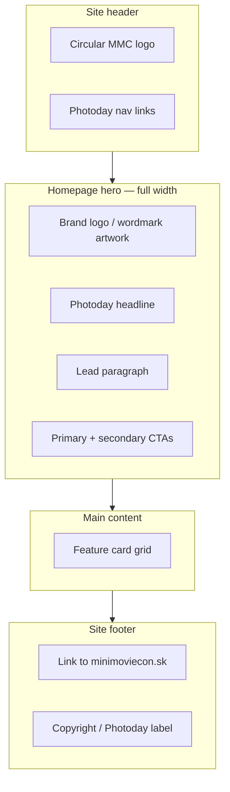
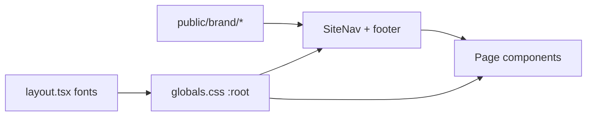

# Mini Movie Con Style Alignment - Plan

## Goal Capsule

- **Objective:** Restyle the photoday app so public pages feel like part of [minimoviecon.sk](https://minimoviecon.sk), using brand assets and patterns extracted from the live main site.
- **Product authority:** Requirements-only brainstorm confirmed 2026-07-11; approach B (theme extraction + component reskin) chosen over token-only swap or full layout rebuild.
- **Open blockers:** None.

---

## Product Contract

**Product Contract preservation:** unchanged — planning adds HOW sections only; R/AE IDs and product scope are preserved from brainstorm.

### Summary

Replace photoday’s generic dark SaaS look (Geist, purple/pink gradients) with Mini Movie Con festival branding extracted from minimoviecon.sk: logo, fonts, colors, header/footer chrome, button treatments, and a photoday-adapted homepage hero. Photoday keeps its own navigation links, styled like the main festival header. Applies to homepage, photographers (list and profiles), locations, bookings (including success), and sessions.

### Problem Frame

Photoday runs at `photoday.minimoviecon.sk` as a subdomain of the festival site but currently looks like a separate product. Visitors who arrive from minimoviecon.sk see a different visual language — Geist typography, purple/pink accent gradients, text-only branding, and a simple text hero — while the main site uses dramatic brand artwork, DM Serif Display headings, Work Sans body copy, blue and gold accents, and a circular MMC logo. That mismatch weakens trust and makes photoday feel bolted on rather than part of the same event experience.

### Key Decisions

- **Theme extraction over formal design kit** — Brand tokens, logo files, and reference patterns are pulled from the live minimoviecon.sk site. Close visual match is the goal; pixel-perfect WordPress/Elementor reproduction is not.
- **Photoday nav, festival chrome** — Navigation links stay photoday-specific (Fotografi, Rezervácie, Termíny, etc.). Header, logo placement, link styling, and footer treatment mirror the main festival site.
- **Adapted homepage hero** — The homepage uses the same brand visual language (logo art, dark atmosphere, gold/blue accents) with photoday messaging and CTAs (rezervácia fotenia, termíny). It does not copy the main site’s “Kúp lístky” ticket CTA verbatim.
- **Extend existing CSS architecture** — Styling changes build on the current plain-CSS approach in `src/app/globals.css`. No new CSS framework or component library for this pass.

### Requirements

**Brand foundation**

- R1. Replace the current accent palette (purple `#7c5cff`, pink `#ff5c8a`) with Mini Movie Con brand colors derived from minimoviecon.sk: primary blue `#0085FF`, hover blue `#0177E3`, white headings, light blue body accent `#E7F6FF`, and dark navy backgrounds (`#0F172A`, `#212A37`, `#070614`).
- R2. Replace Geist as the primary typeface with the main site pairing: **DM Serif Display** for headings and **Work Sans** for body, navigation, forms, and buttons.
- R3. Host festival brand assets locally under `public/` (circular header logo, hero logo/wordmark graphic) extracted from minimoviecon.sk — not hot-linked from the WordPress CDN at runtime.
- R4. Remove or replace purple/pink radial-gradient background treatments so page backgrounds align with the main site’s dark, atmospheric look.

**Shared chrome**

- R5. The site header displays the circular Mini Movie Con logo and photoday branding consistent with minimoviecon.sk header proportions and spacing.
- R6. Photoday navigation links remain: Domov, Fotostanovištia, Fotografi, Rezervácie, Termíny. They are styled like the main festival nav (horizontal layout, hover/active color behavior, readable on dark background).
- R7. Primary and secondary buttons across the app match main-site button character: solid blue primary fills, gold-accent or outlined secondary where appropriate, rounded corners, and hover states consistent with minimoviecon.sk.
- R8. The footer uses festival-appropriate styling (dark background, muted light text) and identifies the page as Mini Movie Con Photoday. A link back to `https://minimoviecon.sk` is included.

**Homepage**

- R9. The homepage hero is a full-width branded section using the extracted logo/wordmark artwork and dark atmospheric background — not the current plain text + gradient-accent treatment.
- R10. Hero copy remains photoday-specific (explains photoday coordination for cosplayers and photographers) with CTAs pointing to `/bookings` and `/sessions`.
- R11. Feature cards below the hero use restyled surfaces (borders, backgrounds, link colors) consistent with the new brand tokens.

**In-scope page surfaces**

- R12. `/photographers` and `/photographers/[id]` — card grids, profile layout, social chips, and back links use the updated brand styling.
- R13. `/locations` — location cards, map links, and empty states use the updated brand styling.
- R14. `/bookings` and `/bookings/success` — form sections, inputs, buttons, summary cards, and status messaging use the updated brand styling.
- R15. `/sessions` — list/placeholder content uses the updated brand styling.
- R16. All in-scope pages share the same header, footer, typography, and token set — no page retains the old purple/pink theme.

**Quality**

- R17. Text meets WCAG AA contrast on dark backgrounds after the palette change.
- R18. Layout remains usable at mobile and desktop breakpoints; restyling does not regress existing responsive behavior.
- R19. Brand images include appropriate `alt` text; decorative hero artwork is marked accordingly.
- R20. Page weight from added brand assets stays reasonable — use appropriately sized logo variants, not full-resolution poster files where a smaller asset suffices.

### Visualizations

Homepage region composition (wireframe):

### Acceptance Examples

- AE1. **Side-by-side brand check**
  - **Covers:** R1, R2, R4, R5, R7
  - **Given:** A visitor opens minimoviecon.sk and photoday.minimoviecon.sk in adjacent tabs
  - **When:** They compare header, colors, fonts, and buttons
  - **Then:** Photoday reads as the same festival family — blue/gold/dark navy palette and serif headings — not a separate purple SaaS product

- AE2. **Homepage hero**
  - **Covers:** R9, R10
  - **Given:** A visitor lands on `/`
  - **When:** The page loads
  - **Then:** They see branded hero artwork, photoday-specific headline and lead copy, and working CTAs to bookings and sessions — no “Kúp lístky” ticket button

- AE3. **Photographer profile continuity**
  - **Covers:** R12, R16
  - **Given:** A visitor browses `/photographers` then opens a profile at `/photographers/[id]`
  - **When:** They navigate between list and detail
  - **Then:** Header, typography, card styling, and buttons stay consistent with the restyled theme

- AE4. **Booking form readability**
  - **Covers:** R14, R17
  - **Given:** A cosplayer opens `/bookings` on a mobile viewport
  - **When:** They interact with form fields and the submit button
  - **Then:** Labels, inputs, and primary action remain readable and tappable with sufficient contrast on dark surfaces

- AE5. **Excluded route unchanged scope**
  - **Covers:** Scope boundary for `/notifications`
  - **Given:** A visitor opens `/notifications`
  - **When:** The page loads after the styling pass
  - **Then:** It may still use the old theme — restyling that route is explicitly deferred

### Success Criteria

- Opening photoday alongside minimoviecon.sk, an organizer or visitor can identify them as the same brand without explanation.
- All requirements R1–R20 are satisfied on in-scope routes.
- No functional regressions in navigation, forms, or catalog pages — this pass changes presentation only.

### Scope Boundaries

**In scope**

- Visual restyle of `/`, `/photographers`, `/photographers/[id]`, `/locations`, `/bookings`, `/bookings/success`, and `/sessions`
- Shared layout components (`SiteNav`, root layout, `globals.css`)
- Local hosting of extracted brand assets

**Deferred for later**

- `/notifications` — remains on current styling until a follow-up pass
- Email template HTML styling to match the new brand (transactional emails may still use plain templates)
- Deeper cross-site integration (embedding photoday nav items on the WordPress main site)

**Outside this product's identity**

- Rebuilding photoday as WordPress or importing Elementor
- Copying the full main-site page structure (sponsor bands, host sections, application blocks from minimoviecon.sk homepage content)
- Changing booking logic, catalog data, or API behavior

### Deferred to Follow-Up Work

- Animated hero effects (fire/smoke) from the main site — static brand artwork and dark atmosphere are sufficient for v1
- Dedicated mobile hamburger menu matching WordPress Astra — existing flex-wrap nav is acceptable if readable at mobile widths (R18)

### Dependencies / Assumptions

- minimoviecon.sk remains accessible for asset and token extraction during implementation.
- Google Fonts (DM Serif Display, Work Sans) may be loaded the same way the main site does — acceptable for brand parity.
- The festival organization accepts photoday hosting copies of public brand images extracted from the main site (same operator, subdomain context).
- Current page structure and CSS class names in `src/app/globals.css` are the restyle surface; no route renames required.

### Sources / Research

- Reference site: [minimoviecon.sk](https://minimoviecon.sk) — Astra theme, Elementor-built homepage, brand colors in inline CSS (`--ast-global-color-0: #0085FF`, backgrounds `#0F172A` / `#212A37`), fonts Work Sans + DM Serif Display.
- Current photoday styling: `src/app/globals.css` (dark theme, Geist, purple/pink tokens), `src/components/SiteNav.tsx`, `src/app/layout.tsx`.
- Extractable assets observed on main site: circular logo (`mini-movie-com-empty-sq-scaled.jpg`), hero wordmark (`mini-movie-con-napis-1riadok-e1721197687170-1024x196.png`).

---

## Planning Contract

### Key Technical Decisions

- **KTD1: `next/font/google` for brand fonts** — Load DM Serif Display and Work Sans via Next.js font optimization in `src/app/layout.tsx`, matching the main site pairing while keeping self-hosted font files out of the repo. Expose CSS variables (`--font-heading`, `--font-body`) for use in `globals.css`.
- **KTD2: Local assets under `public/brand/`** — Download the circular header logo and hero wordmark PNG from minimoviecon.sk once during implementation. Reference via `/brand/...` paths in components. Do not runtime-fetch from the WordPress CDN.
- **KTD3: Token-first reskin in `globals.css`** — Replace `:root` variables and update existing class blocks (`.site-header`, `.hero`, `.feature-card`, `.btn-primary`, etc.) rather than introducing Tailwind or a component library. Page TSX changes are limited to header logo markup and homepage hero structure.
- **KTD4: Gold secondary CTAs, blue primaries** — Primary actions use solid `#0085FF` fills; secondary actions use gold-bordered / gold-fill styling echoing the main site’s “Kúp lístky” button without reusing that label or linking to ticket sales.

### High-Level Technical Design

Styling flows through one shared token layer consumed by all in-scope routes:

No API, database, or routing changes. Existing page components keep their data-fetching logic; only markup classes and shared CSS change.

---

## Implementation Units

### U1. Extract and commit brand assets

- **Goal:** Satisfy R3 and R20 by hosting appropriately sized festival artwork locally.
- **Requirements:** R3, R20
- **Dependencies:** None
- **Files:** `public/brand/mmc-logo.jpg`, `public/brand/mmc-wordmark.png` (names may vary; keep under `public/brand/`)
- **Approach:** Download from minimoviecon.sk:
  - Header logo: `wp-content/uploads/2024/03/mini-movie-com-empty-sq-scaled.jpg` (resize or use a smaller export if file size is excessive)
  - Hero wordmark: `wp-content/uploads/2024/07/mini-movie-con-napis-1riadok-e1721197687170-1024x196.png`
  Commit optimized files only — skip poster/plagát assets.
- **Execution note:** Prefer install/runtime smoke over unit tests — verify assets load at `/brand/...` after `npm run build`.
- **Patterns to follow:** Existing static assets pattern in `public/catalog/` for served media.
- **Test expectation:** none — static asset addition only.
- **Verification:** Built app serves both images; total added asset weight is modest (well under 500 KB combined after optimization).

### U2. Typography and design tokens

- **Goal:** Replace Geist and purple/pink tokens with MMC brand fonts and colors (R1, R2, R4).
- **Requirements:** R1, R2, R4, R17
- **Dependencies:** None (may land in parallel with U1)
- **Files:** `src/app/layout.tsx`, `src/app/globals.css`
- **Approach:**
  - Remove Geist import; add `DM_Serif_Display` and `Work_Sans` from `next/font/google` with CSS variables on `<html>`.
  - Rewrite `:root` tokens: backgrounds, foreground, muted, accent (blue), accent-gold (for secondary CTAs), borders, radii aligned to main site feel.
  - Update `body` background to dark navy/black atmospheric treatment — no purple/pink radial gradients.
  - Set heading font-family to DM Serif Display; body/UI to Work Sans.
- **Patterns to follow:** Current CSS-variable pattern at top of `globals.css`; font loading pattern from existing Geist setup in `layout.tsx`.
- **Test expectation:** none — token layer only; contrast validated in U6.
- **Verification:** No references to `--font-geist-sans`, `#7c5cff`, or `#ff5c8a` remain in `globals.css`.

### U3. Shared chrome — header, footer, buttons

- **Goal:** Festival-styled navigation and footer with photoday links (R5–R8, R7 partial).
- **Requirements:** R5, R6, R7, R8, R16
- **Dependencies:** U1, U2
- **Files:** `src/components/SiteNav.tsx`, `src/app/layout.tsx`, `src/app/globals.css` (`.site-header`, `.site-nav`, `.site-brand`, `.site-footer`, `.cta`, `.btn`, `.btn-primary`, `.btn-secondary`)
- **Approach:**
  - Replace text-only `site-brand` with logo `<Image>` or `` linking to `/`, plus “Photoday” label styled like festival header.
  - Style nav links: light text, gold or blue hover/active consistent with main site.
  - Restyle footer with link to `https://minimoviecon.sk`, muted copy, dark background.
  - Unify `.cta`, `.btn`, `.btn-primary`, `.btn-secondary` to blue primary / gold secondary system.
- **Patterns to follow:** Existing `SiteNav` link array structure; sticky header pattern already in `globals.css`.
- **Test scenarios:**
  - Covers AE1 partial. Nav still exposes link to `/photographers` with label “Fotografi”.
  - Header renders logo with non-empty `alt` (R19).
  - Footer contains external link to minimoviecon.sk.
- **Files (tests):** `src/app/page.test.tsx` (extend nav assertions if brand markup changes selectors)
- **Verification:** All six photoday nav hrefs unchanged; logo visible; footer festival link present.

### U4. Homepage hero and feature cards

- **Goal:** Branded full-width hero with photoday messaging (R9–R11).
- **Requirements:** R9, R10, R11, R19
- **Dependencies:** U1, U2, U3
- **Files:** `src/app/page.tsx`, `src/app/globals.css` (`.hero`, `.feature-grid`, `.feature-card`, `.accent`)
- **Approach:**
  - Restructure homepage hero: full-bleed dark section, centered wordmark image, photoday headline below or beside artwork, existing lead copy, CTA row unchanged in destination (`/bookings`, `/sessions`).
  - Remove gradient `.accent` text clip on “Mini Movie Con” unless replaced with brand-appropriate gold/white treatment.
  - Restyle feature cards to use new surface/border/accent link colors.
- **Patterns to follow:** Existing hero + feature-grid structure in `page.tsx`; CTA copy already in Slovak.
- **Test scenarios:**
  - Covers AE2. Heading still mentions Mini Movie Con; primary CTA “Rezervovať fotenie” links to `/bookings`.
  - Covers R10. Secondary CTA links to `/sessions`.
  - Hero wordmark image present with appropriate alt/decorative marking.
- **Files (tests):** `src/app/page.test.tsx`
- **Verification:** Homepage matches AE2; no ticket-sales CTA text.

### U5. In-scope page CSS pass

- **Goal:** Apply updated tokens to catalog, booking, and sessions surfaces (R12–R16).
- **Requirements:** R12, R13, R14, R15, R16, R17, R18
- **Dependencies:** U2, U3
- **Files:** `src/app/globals.css` (sections: photographer, location, application form, summary, empty-state, sessions if any page-specific classes exist); spot-check page TSX only if inline styles or hardcoded classes exist
- **Approach:** Audit and update CSS blocks for:
  - `.photographer-*`, `.location-*` cards and chips
  - `.application-form`, `.form-field`, `.summary-card`, `.application-status-*`
  - `.empty-state`, `.page-title`, `.page-lead`, `.back-link`
  - Ensure focus rings and error colors remain visible on dark surfaces (R17)
  - Confirm responsive grids unchanged (R18)
- **Execution note:** Smoke-check each in-scope route in browser at mobile and desktop widths after CSS edits.
- **Patterns to follow:** Single-file CSS convention established in photographers/locations plans.
- **Test expectation:** none — presentation-only CSS; existing functional tests must still pass.
- **Verification:** Manual pass on `/photographers`, `/photographers/[id]`, `/locations`, `/bookings`, `/bookings/success`, `/sessions` shows no purple/pink remnants.

### U6. Test updates and verification gate

- **Goal:** Keep automated tests green and confirm acceptance examples (AE1–AE5).
- **Requirements:** R17–R20; validates AE1–AE5
- **Dependencies:** U3, U4, U5
- **Files:** `src/app/page.test.tsx`; optional snapshot or aria assertions if stable
- **Approach:**
  - Update tests broken by nav/hero markup changes (link names and roles should remain stable).
  - Run full test suite and production build.
  - Perform side-by-side visual check against minimoviecon.sk per AE1.
  - Confirm `/notifications` still renders (AE5 — old theme acceptable).
- **Test scenarios:**
  - Covers AE3. Existing photographer routes render without test failures after rebrand.
  - Covers AE4. Booking page tests (if any) still pass; manual mobile check documented in verification notes.
  - All tests in `src/app/page.test.tsx` pass.
- **Verification:** `npm run test` and `npm run build` succeed; AE1 side-by-side check documented as done.

---

## Verification Contract

| Gate | Command / action | Applies to |
|---|---|---|
| Unit tests | `npm run test` | U3, U4, U6 |
| Production build | `npm run build` | All units |
| Lint | `npm run lint` | All units (if CSS/TSX touched) |
| Visual brand check | Open minimoviecon.sk and local dev `/` side by side | U6 (AE1) |
| In-scope route smoke | Load `/`, `/photographers`, `/locations`, `/bookings`, `/sessions` at 375px and 1280px widths | U5, U6 |
| Asset weight | Inspect `public/brand/` total size | U1 |

---

## Definition of Done

- [ ] R1–R20 satisfied on all in-scope routes listed in Scope Boundaries
- [ ] AE1–AE4 verified; AE5 acknowledged (`/notifications` deferred)
- [ ] Brand assets served from `public/brand/` — no runtime hotlinks to minimoviecon.sk CDN
- [ ] Geist and purple/pink theme tokens removed from active styling
- [ ] `npm run test` and `npm run build` pass
- [ ] No booking, catalog, or navigation behavior regressions
