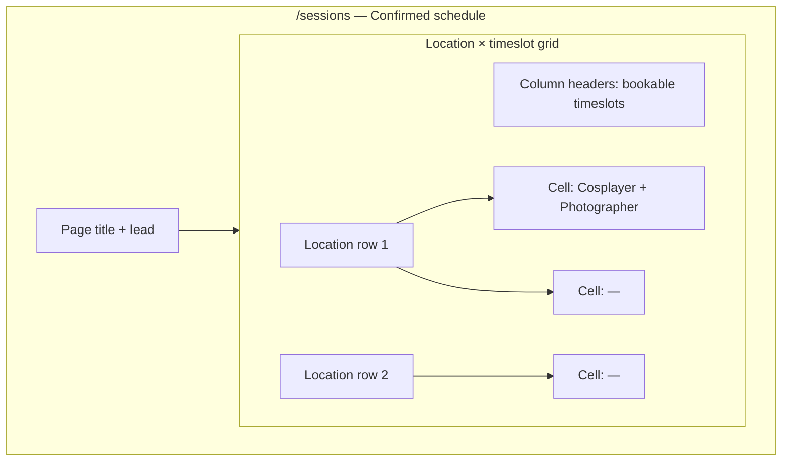
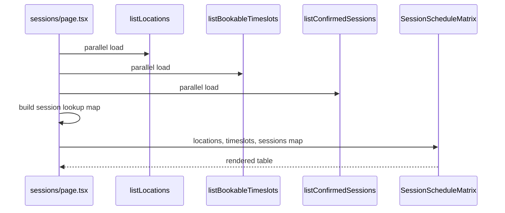
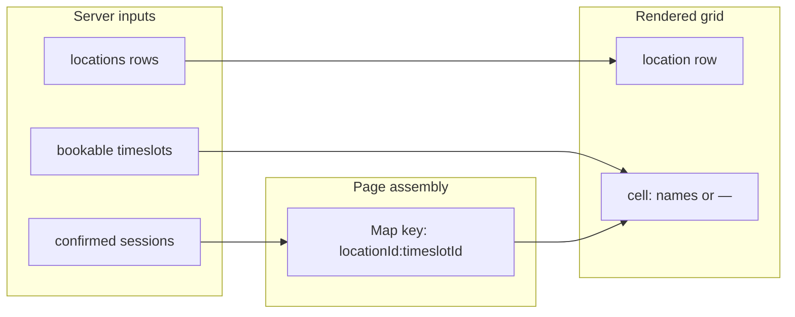

# Sessions Confirmed Schedule - Plan

## Goal Capsule

- **Objective:** Replace the `/sessions` placeholder with a public schedule of all confirmed photoshoot applications, organized as a location × timeslot matrix.
- **Product authority:** Requirements-only brainstorm confirmed 2026-07-12; extends the application flow in `docs/plans/2026-07-11-001-feat-cosplayer-application-form-plan.md` and photographer confirm/revoke on `/photographers/[id]`.
- **Open blockers:** None.

---

## Product Contract

**Product Contract preservation:** unchanged — planning resolves deferred UX questions below without altering R/A/F/AE scope.

### Summary

The `/sessions` page (Termíny) becomes a public timetable of confirmed photoshoot applications. Visitors see a matrix with catalog locations as rows and bookable timeslots as columns. Each occupied cell shows the cosplayer and photographer names. Empty cells show `—`. Only `confirmed` bookings appear; pending applications stay off this page.

### Problem Frame

Mini Movie Con photoday is being organized for the first time. Cosplayers can apply via `/bookings` and photographers can confirm applications on their profile pages, but there is no central place for attendees to see what is scheduled. The `/sessions` route is still a placeholder with a “Pripravuje sa” badge. As confirmations accumulate, the event needs a single public source of truth for who is shooting where and when.

### Key Decisions

- **Public schedule over private queue** — `/sessions` serves anyone at the event, not photographers managing their own applications (that stays on `/photographers/[id]`).
- **Matrix over list** — Location rows and timeslot columns match the placeholder copy (“podľa stanovišťa a času”) and the one-session-per-slot domain rule.
- **Full public names** — Each occupied cell shows cosplayer and photographer names, not anonymized availability.
- **`—` over “Voľné”** — Empty cells highlight confirmed sessions without implying slot availability; pending applications may still exist for that pair.
- **Complete grid** — All catalog locations and all bookable timeslots appear even when mostly empty, so the timetable reads as a full event grid.

### Actors

- A1. **Visitor** — Anyone at the event browsing the public schedule on `/sessions`.
- A2. **Cosplayer** — May use the schedule to see confirmed shoots; applies via `/bookings`, not on this page.
- A3. **Photographer** — Confirms applications on their profile; does not manage the public schedule here.

### Requirements

**Data and filtering**

- R1. The page lists only bookings with status `confirmed`. Pending applications do not appear.
- R2. Each listed session shows cosplayer name, photographer name, location name, and timeslot label with start time.
- R3. At most one confirmed booking exists per location+timeslot pair; the matrix shows that booking in the matching cell.

**Matrix layout**

- R4. The page renders a matrix with one row per catalog location and one column per bookable timeslot (9:30, 11:00, 12:30 — not gatherup).
- R5. Row and column headers identify the location and timeslot (label and start time).
- R6. An occupied cell displays the cosplayer name and photographer name for the confirmed session at that intersection.
- R7. A cell with no confirmed session displays `—`.
- R8. All catalog locations appear as rows even when they have no confirmed sessions.
- R9. All bookable timeslots appear as columns even when no location has a confirmed session in that slot.

**Page experience**

- R10. The `/sessions` route replaces the current placeholder content and removes the “Pripravuje sa” badge when the schedule is live.
- R11. The page heading and lead copy describe a public overview of confirmed shoots (Termíny), consistent with the existing Slovak page title.
- R12. When no confirmed sessions exist anywhere, the page still renders the matrix structure with `—` in every cell and a short empty-state message explaining that confirmed sessions will appear after photographers approve applications.
- R13. The page is publicly readable without login or photographer `loginHash`.

**Schedule layout (wireframe)**

### Key Flows

- F1. **Visitor views the public schedule**
  - **Trigger:** Visitor opens `/sessions` from site navigation or homepage CTA.
  - **Actors:** A1
  - **Steps:** Page loads confirmed bookings → builds location × timeslot matrix → visitor scans rows and columns for confirmed shoots.
  - **Outcome:** Visitor knows who is scheduled where and when.
  - **Covered by:** R1, R2, R4–R7, R10, R13

- F2. **Schedule updates after photographer confirmation**
  - **Trigger:** A photographer confirms a pending application on `/photographers/[id]`.
  - **Actors:** A3, A1
  - **Steps:** Booking status becomes `confirmed` → next visit to `/sessions` shows the session in the matching matrix cell.
  - **Outcome:** Public schedule reflects the new confirmation.
  - **Covered by:** R1, R3, R6

- F3. **Schedule reflects revocation**
  - **Trigger:** A photographer revokes a confirmed application on `/photographers/[id]`.
  - **Actors:** A3, A1
  - **Steps:** Booking status returns to `pending` → next visit to `/sessions` removes the session from the matrix; the cell shows `—`.
  - **Outcome:** Public schedule no longer lists the revoked session.
  - **Covered by:** R1, R7

### Acceptance Examples

- AE1. **Fully empty event**
  - **Covers:** R8, R9, R12
  - **Given:** Catalog has locations and bookable timeslots but no confirmed bookings
  - **When:** A visitor opens `/sessions`
  - **Then:** The matrix shows all location rows and timeslot columns with `—` in every cell, plus a message that confirmed sessions will appear after approvals

- AE2. **Single confirmed session**
  - **Covers:** R3, R6, R7
  - **Given:** One confirmed booking for Location A at 11:00 with cosplayer “Mia” and photographer “Betty”
  - **When:** A visitor opens `/sessions`
  - **Then:** The cell at Location A × 11:00 shows Mia and Betty; all other cells show `—`

- AE3. **Pending application does not appear**
  - **Covers:** R1, R7
  - **Given:** A pending application exists for Location B at 9:30 but no confirmed booking for that pair
  - **When:** A visitor opens `/sessions`
  - **Then:** The Location B × 9:30 cell shows `—`, not the pending applicant

### Scope Boundaries

**Deferred for later**

- Pending applications on `/sessions`
- Confirm/revoke actions on `/sessions`
- Photographer-scoped application lists (stay on `/photographers/[id]`)
- Organizer admin, notifications page, cosplayer accounts
- Booking statuses beyond `pending` and `confirmed` (cancelled, no-show)
- “Voľné” or availability signaling on empty cells
- Real-time or push updates without page refresh

**Outside this product's identity**

- Private cosplayer booking history
- Email on schedule changes

### Dependencies / Assumptions

- Confirmed photoshoot applications already exist as `bookings` rows with `status = 'confirmed'`, created via `/bookings` and confirmed on `/photographers/[id]`.
- Catalog locations and bookable timeslots are loaded from the existing data layer (`listLocations`, `listBookableTimeslots`).
- The confirm-only slot hold rule remains: at most one confirmed booking per location+timeslot pair.
- This is the first photoday run; no legacy schedule or migration from spreadsheets is required.

### Outstanding Questions

**Resolved in Planning**

- Mobile presentation → horizontal scroll wrapper on narrow viewports; matrix semantics preserved (Planning Contract).
- Cell name ordering → cosplayer name first, photographer name second, matching `PhotographerApplicationList` emphasis (Planning Contract).
- Photographer profile links → photographer name links to `/photographers/[id]`; cosplayer name is plain text (Planning Contract).

**Deferred to Implementation**

- Exact Slovak empty-state copy wording — keep tone consistent with `/locations` and `/bookings` empty states.

### Sources / Research

- `src/app/sessions/page.tsx` — Current placeholder to replace.
- `src/db/applications.ts` — `listApplicationsForPhotographer`, `listConfirmedLocationTimeslotKeys`; no global confirmed-session query yet.
- `src/components/PhotographerApplicationList.tsx` — Timeslot formatting and cosplayer-first display pattern.
- `src/app/locations/page.tsx` — Server page pattern with `force-dynamic`, catalog load, empty state.
- `src/app/bookings/page.test.tsx` — Async server page test pattern with mocked DB modules.
- `docs/architecture/app-workflow.md` — One booking per location per shoot timeslot rule.

---

## Planning Contract

### Summary

Add a confirmed-session query to the applications data layer, a matrix presentation component, and wire `/sessions` as a dynamic server page that loads locations, bookable timeslots, and confirmed bookings in parallel. The page builds a lookup map keyed by `locationId:timeslotId` and renders a scrollable HTML table. No schema migration required.

### Key Technical Decisions

- **New `listConfirmedSessions` query** — Single joined select returning cosplayer name, photographer name + id, location id + name, timeslot id + label + start time for `status = 'confirmed'`. Mirrors `listApplicationsForPhotographer` join pattern; lives in `src/db/applications.ts`.
- **Matrix assembly on the server page** — `src/app/sessions/page.tsx` loads `listLocations()`, `listBookableTimeslots()`, and `listConfirmedSessions()` in parallel, builds a `Map` keyed by `${locationId}:${timeslotId}`, passes structured props to a presentational component. Keeps DB logic out of the component.
- **HTML `<table>` with horizontal scroll** — Semantic table for location × timeslot grid. Wrap in `.schedule-matrix-scroll` for overflow-x on mobile rather than stacking into separate sections (preserves cross-location comparison at a glance).
- **Cosplayer first, linked photographer** — Cell shows cosplayer name as text, photographer name as a link to `/photographers/[id]`. Low-cost navigation to profiles without exposing cosplayer emails.
- **`export const dynamic = "force-dynamic"`** — Schedule must reflect latest confirmations without static caching; matches `/locations` and `/photographers/[id]`.
- **Reuse timeslot header format** — Same `label (HH:MM)` pattern as `PhotographerApplicationList.formatTimeslot`.
- **No new API routes** — Server Component only; consistent with existing catalog and booking pages.

### High-Level Technical Design

**Page data flow:**

**Matrix lookup model:**

### Assumptions

- Catalog import and timeslot seed are applied in dev/staging (same as `/bookings`).
- At most one confirmed row per location+timeslot is enforced by `confirmApplicationByPhotographer`; the map builder can safely use last-write-wins if duplicates ever appear, but tests should assume one row per key.

---

## Implementation Units

### U1. Data access — list confirmed sessions

**Goal:** Expose a query that returns all confirmed bookings with joined display fields for the public schedule.

**Requirements:** R1, R2, R3

**Dependencies:** none

**Files:**

- Modify: `src/db/applications.ts`
- Modify: `src/db/applications.test.ts`

**Approach:** Add `ConfirmedSessionSummary` type with `id`, `cosplayerName`, `photographerId`, `photographerName`, `locationId`, `locationName`, `timeslotId`, `timeslotLabel`, `timeslotStartTime`. Implement `listConfirmedSessions()` with the same join pattern as `listApplicationsForPhotographer` but filtered to `eq(bookings.status, "confirmed")` and ordered by location id then timeslot id. Export the type for the component.

**Patterns to follow:** `listApplicationsForPhotographer` in `src/db/applications.ts`.

**Test scenarios:**

- Returns only rows where status is `confirmed` (pending rows excluded)
- Joined fields include cosplayer name, photographer id + name, location id + name, timeslot id + label + start time
- Empty array when no confirmed bookings exist

**Verification:** `npm run test -- src/db/applications.test.ts` passes.

---

### U2. Presentation — SessionScheduleMatrix component

**Goal:** Render the location × timeslot matrix with headers, occupied cells, and `—` placeholders.

**Requirements:** R4–R9, R12

**Dependencies:** U1 (type shape)

**Files:**

- Create: `src/components/SessionScheduleMatrix.tsx`
- Create: `src/components/SessionScheduleMatrix.test.tsx`
- Modify: `src/app/globals.css`

**Approach:** Accept props: `locations` (id, name), `timeslots` (id, label, startTime, bookable), `sessionsByKey` (Record or Map keyed by `locationId:timeslotId` → session summary). Render `<table className="schedule-matrix">` with `<thead>` timeslot columns and `<tbody>` location rows. Occupied cells show cosplayer name and linked photographer name. Empty cells show `—`. When `sessionsByKey` is empty, render the full grid plus an `.empty-state` message above or below the table per R12. Add `.schedule-matrix-scroll` wrapper styles and cell typography in `globals.css`; use horizontal scroll on narrow viewports.

**Patterns to follow:** `PhotographerApplicationList.tsx` for timeslot formatting; `empty-state` classes from `globals.css`.

**Test scenarios:**

- Covers AE1. Renders all location rows and timeslot columns with `—` when sessions map is empty; shows empty-state message
- Covers AE2. Renders cosplayer and photographer in the matching cell; other cells show `—`
- Covers AE3. Pending sessions are not in the map; cell shows `—`
- Column headers include timeslot label and start time
- Photographer name renders as a link to `/photographers/[id]`

**Verification:** `npm run test -- src/components/SessionScheduleMatrix.test.tsx` passes.

---

### U3. Route — wire `/sessions` server page

**Goal:** Replace the placeholder page with a live public schedule.

**Requirements:** R10, R11, R13; F1

**Dependencies:** U1, U2

**Files:**

- Modify: `src/app/sessions/page.tsx`
- Modify: `src/app/placeholders.test.tsx` (rename or split; update sessions tests)
- Create: `src/app/sessions/page.test.tsx`

**Approach:** Set `export const dynamic = "force-dynamic"`. In the default export, `Promise.all` load locations, bookable timeslots, and confirmed sessions. Build the session lookup map. Update page title/lead copy to describe confirmed shoots (remove “Pripravuje sa” badge). Handle catalog-not-ready edge case: if locations or timeslots arrays are empty, show the existing empty-state pattern (similar to `/locations`) instead of an empty table. Otherwise render `SessionScheduleMatrix`.

**Patterns to follow:** `src/app/locations/page.tsx` for server page structure; `src/app/bookings/page.test.tsx` for async page tests with mocked DB.

**Test scenarios:**

- Renders heading “Termíny” and updated lead copy
- Does not render “Pripravuje sa” placeholder badge
- Passes loaded data into matrix when catalog exists
- Shows catalog empty state when locations or timeslots are empty

**Verification:** `npm run test -- src/app/sessions/page.test.tsx` passes; manual check at `/sessions`.

---

### U4. Integration verification and placeholder cleanup

**Goal:** Ensure the full feature passes build and existing tests; remove stale placeholder expectations.

**Requirements:** R1–R13; AE1–AE3

**Dependencies:** U1, U2, U3

**Files:**

- Modify: `src/app/placeholders.test.tsx`

**Approach:** Move sessions-specific tests to `src/app/sessions/page.test.tsx` (U3). Keep notifications placeholder test in `placeholders.test.tsx`. Run full test suite and build.

**Test expectation:** none — verification-only unit.

**Verification:** `npm run test` and `npm run build` pass.

---

## Verification Contract

| Gate | Command | Applies to |
|------|---------|------------|
| Unit tests | `npm run test` | U1–U3 |
| DB applications tests | `npm run test -- src/db/applications.test.ts` | U1 |
| Matrix component tests | `npm run test -- src/components/SessionScheduleMatrix.test.tsx` | U2 |
| Sessions page tests | `npm run test -- src/app/sessions/page.test.tsx` | U3 |
| Production build | `npm run build` | U4 |

Manual smoke: load `/sessions` at 375px and 1280px widths; confirm horizontal scroll works and a confirmed booking (if present in DB) appears in the correct cell.

---

## Definition of Done

- `/sessions` shows a location × timeslot matrix of confirmed sessions with cosplayer and linked photographer names; empty cells show `—`.
- Pending applications never appear on `/sessions`.
- Placeholder badge and copy are removed; page is publicly accessible without auth.
- All Verification Contract gates pass.
- No schema migration required for this feature.
