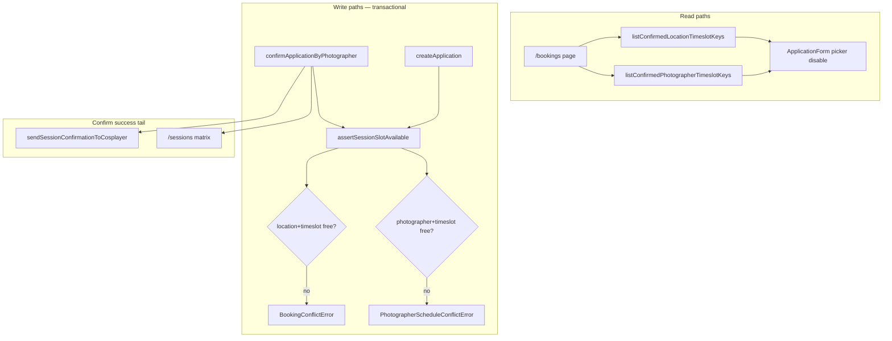

# Slot Validation - Plan

## Goal Capsule

- **Objective:** Prevent double-booking by enforcing photographer schedule limits at apply and confirm time, with proactive cosplayer-form feedback and photographer-controlled location/timeslot override on confirm.
- **Product authority:** Requirements-only brainstorm confirmed 2026-07-12; extends `docs/plans/2026-07-11-001-feat-cosplayer-application-form-plan.md` and scheduling vocabulary in `CONCEPTS.md`.
- **Open blockers:** None.

---

## Product Contract

**Product Contract preservation:** unchanged — planning adds HOW sections only; no R/A/F/AE scope changes.

### Summary

Add **photographer schedule validation** so a photographer cannot hold two confirmed sessions at the same bookable timeslot, even at different locations. The cosplayer form proactively disables timeslots where the selected photographer is already confirmed busy. Photographer confirm always shows editable location and timeslot pickers (defaulting to the cosplayer's application), validates both location and photographer availability, rejects duplicate confirm races with a clear error, and emails the cosplayer the final confirmed details every time.

### Problem Frame

The photoday hub already blocks a location+timeslot pair once a session is confirmed, and the cosplayer application form hides those pairs in the picker. It does not check whether the chosen photographer is already confirmed elsewhere at the same timeslot. A photographer can therefore confirm two sessions scheduled for the same time at different locations — a real scheduling conflict the event cannot honor.

Photographer confirm today is a one-click approval with no way to adjust location or timeslot when the cosplayer's original choice is awkward or blocked. Cosplayers only learn final session details from the pending application email; there is no confirmation email when a photographer approves.

### Key Decisions

- **Two independent confirmed constraints** — A valid confirmed session must satisfy both: (1) at most one confirmed booking per location+timeslot, and (2) at most one confirmed booking per photographer+timeslot. Pending applications continue not to hold either constraint.
- **Photographer busy means confirmed only** — Pending applications for the same photographer at the same timeslot are allowed until one is confirmed; a second confirm attempt fails with a photographer-specific error.
- **Shared availability validation** — Apply, confirm, and form data loading use one validation concept covering location+timeslot and photographer+timeslot rules rather than divergent checks.
- **Always-editable confirm pickers** — Every photographer confirm shows location and timeslot selectors defaulting to the cosplayer's submitted values; confirm persists the chosen values, not only the original application.
- **Email on every confirm** — Cosplayer receives a confirmation email with final location, timeslot, and photographer details whenever a photographer confirms, whether or not values changed from the application.

### Actors

- A1. **Cosplayer** — Applies for a session; sees timeslots disabled when the selected photographer is confirmed busy at that time; receives confirmation email when approved.
- A2. **Photographer** — Reviews pending applications; confirms with optional location/timeslot override; sees clear errors when confirm would double-book the location or the photographer's schedule.
- A3. **Organizer** — Out of scope for this milestone beyond existing notification flows.
- A4. **Visitor** — Browses the public confirmed schedule on `/sessions`; sees sessions reflecting photographer-confirmed details including any override.

### Requirements

**Availability rules**

- R1. A **confirmed** booking blocks its location+timeslot pair for all new applications and confirms, consistent with the existing confirm-only location hold.
- R2. A **confirmed** booking blocks its photographer+timeslot pair for all new applications and confirms, regardless of location.
- R3. **Pending** bookings do not block location+timeslot or photographer+timeslot availability at apply time.
- R4. Only bookable timeslots (9:30, 11:00, 12:30) may be selected or confirmed; gatherup remains non-bookable.

**Cosplayer application form**

- R5. When a cosplayer selects a photographer, timeslot options where that photographer already has a **confirmed** session at that timeslot are disabled or marked unavailable in the picker, regardless of location.
- R6. Existing location+timeslot blocking in the picker (confirmed sessions only) remains in effect alongside R5.
- R7. Submit rejects the application if the selected photographer is confirmed busy at the chosen timeslot, even if the UI state was stale.
- R8. Submit rejects the application if the chosen location+timeslot pair is confirmed occupied, even if the UI state was stale.
- R9. Submit still succeeds when other **pending** applications target the same location+timeslot or the same photographer+timeslot.

**Photographer confirm with override**

- R10. Confirming a pending application presents location and timeslot pickers pre-filled with the cosplayer's submitted values; the photographer may change either before confirming.
- R11. Confirm persists the booking as **confirmed** with the photographer's chosen location and timeslot (which may differ from the original application).
- R12. Confirm rejects when the chosen location+timeslot already has a different confirmed booking.
- R13. Confirm rejects when the photographer already has a different confirmed booking at the chosen timeslot.
- R14. When confirm fails because the photographer is already confirmed at that timeslot (including a race where another pending application was confirmed first), the photographer sees a distinct, actionable error message — not a generic failure.
- R15. Confirm rejects when the application is not pending, does not belong to the photographer, or the chosen timeslot is not bookable.

**Post-confirm experience**

- R16. After successful confirm, the cosplayer receives an email with final session details (cosplayer name, photographer, location, timeslot, confirmed status wording).
- R17. The confirmed session appears on `/sessions` with the final location, timeslot, and participants reflecting any override.

**Error messaging**

- R18. Cosplayer-facing conflict errors distinguish location+timeslot taken from photographer schedule conflict where practical.
- R19. Photographer-facing conflict errors distinguish location+timeslot taken from photographer schedule conflict.

### Key Flows

- F1. **Cosplayer applies with photographer schedule awareness**
  - **Trigger:** Cosplayer completes the application form on `/bookings`.
  - **Actors:** A1
  - **Steps:** Cosplayer enters identity, selects photographer, location, and timeslot. Picker disables timeslots blocked by location+timeslot or photographer+timeslot confirmed sessions. Submit validates both constraints server-side and creates a pending application on success.
  - **Outcome:** Pending application created, or submit rejected with a clear conflict message.
  - **Covered by:** R5–R9

- F2. **Photographer confirms with optional override**
  - **Trigger:** Photographer opens their application list and confirms a pending application.
  - **Actors:** A2, A1 (notified)
  - **Steps:** Photographer reviews pending application, optionally changes location or timeslot in always-visible pickers, submits confirm. System validates bookability, location+timeslot availability, and photographer schedule; on success sets status to confirmed with chosen values, sends cosplayer confirmation email, and updates the public schedule.
  - **Outcome:** Confirmed session with final location and timeslot, or confirm rejected with a specific conflict error.
  - **Covered by:** R10–R17

- F3. **Duplicate pending confirm race**
  - **Trigger:** Two pending applications exist for the same photographer at the same timeslot (different locations); photographer confirms one, then attempts to confirm the other.
  - **Actors:** A2
  - **Steps:** First confirm succeeds. Second confirm validates photographer+timeslot and fails because the photographer is now confirmed busy at that timeslot.
  - **Outcome:** Second application stays pending; photographer sees photographer-schedule conflict error.
  - **Covered by:** R2, R13, R14

### Acceptance Examples

- AE1. **Photographer already confirmed elsewhere**
  - **Covers:** R2, R5, R7
  - **Given:** Photographer P has a confirmed session at timeslot T at location L1.
  - **When:** A cosplayer selects P and timeslot T (any location) on the application form.
  - **Then:** Timeslot T is disabled or marked unavailable for P, and submit is rejected if attempted anyway.

- AE2. **Location taken but photographer free**
  - **Covers:** R1, R6, R8
  - **Given:** Location L2 + timeslot T has a confirmed session with a different photographer.
  - **When:** A cosplayer selects L2 and T.
  - **Then:** The timeslot option is disabled for that location and submit is rejected server-side.

- AE3. **Confirm with override to free slot**
  - **Covers:** R10, R11, R16
  - **Given:** Pending application for location L3, timeslot T, photographer P; L3+T is free and P is free at T.
  - **When:** Photographer confirms while changing location to L4 (free at T).
  - **Then:** Booking is confirmed at L4+T; cosplayer receives confirmation email showing L4 and T.

- AE4. **Confirm race on photographer schedule**
  - **Covers:** R2, R13, R14, F3
  - **Given:** Pending applications A and B both assign photographer P to timeslot T at different locations; neither constraint is violated while pending.
  - **When:** Photographer confirms A, then attempts to confirm B at the original timeslot T.
  - **Then:** A is confirmed; B confirm fails with photographer-schedule conflict messaging; B remains pending.

- AE5. **Override blocked by location conflict**
  - **Covers:** R12
  - **Given:** Pending application for P at L5+T; another confirmed session already occupies L6+T.
  - **When:** Photographer attempts confirm while selecting L6 and T.
  - **Then:** Confirm fails with location+timeslot conflict messaging; application stays pending.

### Success Criteria

- No photographer has two confirmed bookings sharing the same bookable timeslot.
- No location+timeslot pair has two confirmed bookings (regression guard for existing rule).
- Cosplayer form and both server write paths reject stale or manipulated submissions that violate either constraint.
- Photographer confirm UI supports override on every pending application without a separate "edit mode."
- Cosplayer confirmation email sends on every successful confirm with final session details.

### Scope Boundaries

**Deferred for later**

- Rescheduling or revoking confirmed sessions with automatic conflict re-validation beyond today's revoke-to-pending behavior.
- Auto-rejecting or auto-withdrawing other pending applications when one is confirmed.
- Pending applications blocking photographer or location availability before confirm.
- Organizer-side confirm or override flows.

**Outside this product's identity**

- Per-photographer configurable slot capacity (more than one concurrent session).
- Waitlists or priority queues when a slot is taken.

### Dependencies / Assumptions

- Existing pending/confirmed booking model, photographer login-hash access, and application notification emails from the cosplayer application milestone remain in place.
- Bookable timeslot catalog and location catalog are unchanged.
- Email delivery infrastructure used for application notifications extends to confirmation emails.

### Sources / Research

- `src/db/applications.ts` — `createApplication` and `confirmApplicationByPhotographer` enforce location+timeslot confirmed conflicts only today.
- `src/components/ApplicationForm.tsx` — picker blocks location+timeslot confirmed keys only.
- `src/db/bookings.ts` — `hasConfirmedBookingAtSlot` and `BookingConflictError` pattern to extend.
- `docs/plans/2026-07-11-001-feat-cosplayer-application-form-plan.md` — original confirm-only location hold decision; photographer constraint is additive.
- `CONCEPTS.md` — scheduling vocabulary for photographer schedule constraint and confirm override.

---

## Planning Contract

### Key Technical Decisions

- **KTD1 — Separate conflict error types** — Keep `BookingConflictError` for location+timeslot conflicts (existing callers and tests). Add `PhotographerScheduleConflictError` in `src/db/bookings.ts` for photographer+timeslot conflicts so server actions and UI can map distinct Slovak messages (R18, R19) without string-matching error messages.
- **KTD2 — Centralize availability checks in `src/db/bookings.ts`** — Extend the existing slot helpers rather than duplicating queries in `applications.ts`. Add `hasConfirmedBookingForPhotographerAtTimeslot(photographerId, timeslotId, excludeBookingId?)` and a small `assertSessionSlotAvailable({ locationId, timeslotId, photographerId, excludeBookingId? })` that throws the appropriate error after bookable-timeslot validation. Both write paths call this helper inside their existing transactions.
- **KTD3 — Photographer-timeslot keys for the form** — Add `listConfirmedPhotographerTimeslotKeys()` alongside `listConfirmedLocationTimeslotKeys()` in `src/db/applications.ts`, returning `{ photographerId, timeslotId }[]` from confirmed bookings. The bookings page loads both lists in parallel (mirrors current `confirmedKeys` pattern).
- **KTD4 — Confirm override via expanded confirm signature** — Change `confirmApplicationByPhotographer(applicationId, photographerId, { locationId, timeslotId })` to accept explicit location/timeslot chosen at confirm time. Default to the pending booking's stored values when the action receives them from hidden fields pre-filled by the UI. Update persists `{ status: 'confirmed', locationId, timeslotId }` atomically after validation.
- **KTD5 — Confirm UI stays in `PhotographerApplicationList`** — Each pending row renders location and timeslot `<select>` elements inside the existing confirm form (always visible when `canManage`, not a separate edit mode). The photographer page passes `locations` and `bookableTimeslots` props loaded server-side, same catalogs as `/bookings`.
- **KTD6 — Confirmation email mirrors application email shape** — Add `sendSessionConfirmationToCosplayer` in `src/email/application-emails.ts` with confirmed-status wording (distinct subject/body from pending application email). Fire from `confirmApplicationAction` after successful confirm; email failure is logged but does not roll back the confirm (matches existing apply-path email behavior in `src/app/bookings/actions.ts`).

### High-Level Technical Design

Validation runs inside the existing Drizzle transactions so confirm races resolve at commit time. The `excludeBookingId` parameter is unused on create; on confirm it excludes the application being confirmed when checking photographer schedule (not needed for location check if the booking could move slots, but include for consistency if the same location+timeslot is already held by this booking transitioning pending→confirmed).

### Assumptions

- No schema migration is required — location, timeslot, and photographer are already columns on `bookings`.
- Revoke-to-pending (`revokeApplicationByPhotographer`) stays unchanged; freeing a slot by revoke is sufficient for manual recovery without auto-rejecting competing pending apps.
- Photographer confirm pickers use the same bookable timeslot list as the cosplayer form (`listBookableTimeslots`).

---

## Implementation Units

### U1. Shared availability helpers and list queries

- **Goal:** Single source of truth for both confirmed constraints and photographer-timeslot key listing.
- **Requirements:** R1, R2, R4, R7, R8, R12, R13
- **Dependencies:** None
- **Files:** `src/db/bookings.ts`, `src/db/bookings.test.ts`, `src/db/applications.ts`, `src/db/applications.test.ts`
- **Approach:** Add `PhotographerScheduleConflictError`. Add `hasConfirmedBookingForPhotographerAtTimeslot` query mirroring `hasConfirmedBookingAtSlot`. Add `assertSessionSlotAvailable` that checks bookable flag via timeslots table, then both confirmed constraints, throwing the typed errors. Add `listConfirmedPhotographerTimeslotKeys`. Refactor `createApplication` inline conflict queries to call `assertSessionSlotAvailable`.
- **Patterns to follow:** Existing `hasConfirmedBookingAtSlot` and transaction-scoped selects in `src/db/applications.ts`; error class pattern in `src/db/bookings.ts`.
- **Test scenarios:**
  - Covers AE1 / AE2. `assertSessionSlotAvailable` throws `BookingConflictError` when location+timeslot confirmed elsewhere.
  - Covers AE1. Throws `PhotographerScheduleConflictError` when photographer confirmed at timeslot elsewhere.
  - Passes when both constraints free.
  - Throws `NonBookableTimeslotError` for gatherup/non-bookable id.
  - `listConfirmedPhotographerTimeslotKeys` returns distinct photographer+timeslot pairs from confirmed rows only.
- **Verification:** Unit tests pass; no behavior change yet on confirm path beyond shared helper used by create.

### U2. Confirm with override and distinct action errors

- **Goal:** Photographer confirm accepts chosen location/timeslot, validates both constraints, maps errors to distinct query params.
- **Requirements:** R10–R15, R19, F2, F3
- **Dependencies:** U1
- **Files:** `src/db/applications.ts`, `src/db/applications.test.ts`, `src/app/photographers/[id]/actions.ts`, `src/app/photographers/[id]/actions.test.ts`, `src/app/photographers/[id]/action-errors.ts`, `src/app/photographers/[id]/page.test.tsx`
- **Approach:** Extend `confirmApplicationByPhotographer` to accept `{ locationId, timeslotId }`, validate with `assertSessionSlotAvailable`, update booking with status + location + timeslot in one `set()`, and return `ApplicationDetail` (or equivalent) with final labels for the email step. Parse location/timeslot from FormData in `confirmApplicationAction`. Map `PhotographerScheduleConflictError` to `actionError=photographer_busy`; keep `slot_taken` for location conflict.
- **Test scenarios:**
  - Covers AE3. Confirm with override updates location/timeslot and sets confirmed.
  - Covers AE4. Second confirm for same photographer+timeslot throws `PhotographerScheduleConflictError`.
  - Covers AE5. Override to taken location+timeslot throws `BookingConflictError`.
  - Rejects non-pending, wrong photographer, non-bookable timeslot (existing cases preserved).
  - `confirmApplicationAction` redirects with `photographer_busy` and `slot_taken` respectively.
  - `actionErrorMessage('photographer_busy')` returns distinct Slovak copy.
- **Verification:** DB and action tests green; confirm still no-ops UI until U3.

### U3. Photographer confirm UI with always-visible pickers

- **Goal:** Pending application rows show location/timeslot selectors defaulting to application values.
- **Requirements:** R10, R11, F2
- **Dependencies:** U2
- **Files:** `src/components/PhotographerApplicationList.tsx`, `src/components/PhotographerApplicationList.test.tsx`, `src/app/photographers/[id]/page.tsx`, `src/app/photographers/[id]/page.test.tsx`
- **Approach:** Add `locations` and `timeslots` props to `PhotographerApplicationList`. Extend `PhotographerApplicationSummary` (and `listApplicationsForPhotographer` select) with `locationId` and `timeslotId` so pickers can default correctly. For each pending item, render `<select name="locationId">` and `<select name="timeslotId">` with options from props, default selected to the application's current values. Load catalogs on photographer page via `listLocations` + `listBookableTimeslots`. Style consistently with application form field classes.
- **Test scenarios:**
  - Pending application renders location and timeslot selects with application values pre-selected.
  - Confirmed application does not render override selects (revoke form unchanged).
  - Form includes hidden applicationId, photographerId, loginHash as today.
- **Verification:** Component and page tests pass; manual confirm with override updates `/sessions` matrix (R17 — existing page, no code change expected if confirm persists correctly).

### U4. Cosplayer form photographer-aware blocking

- **Goal:** Proactive timeslot disable for photographer schedule plus server-side distinct errors on submit.
- **Requirements:** R5, R6, R7, R8, R9, R18, F1
- **Dependencies:** U1
- **Files:** `src/components/ApplicationForm.tsx`, `src/components/ApplicationForm.test.tsx`, `src/app/bookings/page.tsx`, `src/app/bookings/page.test.tsx`, `src/app/bookings/actions.ts`, `src/app/bookings/actions.test.ts`
- **Approach:** Add `confirmedPhotographerTimeslotKeys` prop. Extend `isSlotBlocked` logic: block timeslot when (a) location+timeslot in `confirmedKeys`, OR (b) selected photographer + timeslot in photographer keys. Disable submit when blocked. In `submitApplication`, catch `PhotographerScheduleConflictError` with new Slovak message distinct from location conflict.
- **Test scenarios:**
  - Covers AE1. Timeslot disabled when photographer confirmed at that timeslot (different location).
  - Covers AE2. Timeslot still disabled when location+timeslot taken (regression).
  - Timeslot enabled when only pending apps exist for photographer+timeslot (R9).
  - Re-selecting photographer updates which timeslots are disabled.
  - Submit action returns photographer-specific error on `PhotographerScheduleConflictError`.
  - Bookings page passes both key lists to form.
- **Verification:** Form, page, and action tests pass.

### U5. Cosplayer confirmation email

- **Goal:** Email cosplayer with final confirmed session details after every successful confirm.
- **Requirements:** R16, AE3
- **Dependencies:** U2
- **Files:** `src/email/application-emails.ts`, `src/email/application-emails.test.ts`, `src/email/index.ts`, `src/app/photographers/[id]/actions.ts`, `src/app/photographers/[id]/actions.test.ts`
- **Approach:** Add `sendSessionConfirmationToCosplayer` with summary lines and "Stav: potvrdené" wording; subject distinct from pending receipt. After confirm succeeds, load cosplayer email/name and final location/timeslot labels (return detail from confirm function or re-fetch application). Wrap send in try/catch with console.error on failure.
- **Test scenarios:**
  - Email includes photographer, location, timeslot, confirmed status wording.
  - Confirm action invokes send after successful confirm (mocked).
  - Email failure does not prevent redirect success.
- **Verification:** Email unit tests and action test pass.

---

## Verification Contract

| Gate | Command | Applies to |
|---|---|---|
| Unit / component tests | `npm test` | All units |
| Lint | `npm run lint` | All units |
| Production build | `npm run build` | Full feature (after U5) |

Run `npm test` after each unit; run full trio before marking complete.

---

## Definition of Done

- [ ] **U1** — Shared helpers and photographer-timeslot key list with tests
- [ ] **U2** — Confirm with override, typed errors, action error mapping with tests
- [ ] **U3** — Photographer confirm UI pickers with tests
- [ ] **U4** — Cosplayer form blocking and submit errors with tests
- [ ] **U5** — Confirmation email wired with tests
- [ ] `npm test`, `npm run lint`, and `npm run build` all pass
- [ ] Acceptance examples AE1–AE5 covered by automated tests cited above
- [ ] No photographer can hold two confirmed sessions at the same bookable timeslot (R2 success criterion)
- [ ] Location+timeslot single-confirmed rule unchanged (R1 regression)

---

## Scope Boundaries

### Deferred to Follow-Up Work

- Visual schedule hint on photographer confirm screen (mini calendar of confirmed sessions) — optional polish from brainstorm, not required for core fix.
- Refactoring `createBooking` in `src/db/bookings.ts` to use `assertSessionSlotAvailable` — adjacent cleanup, out of scope unless touched incidentally.
